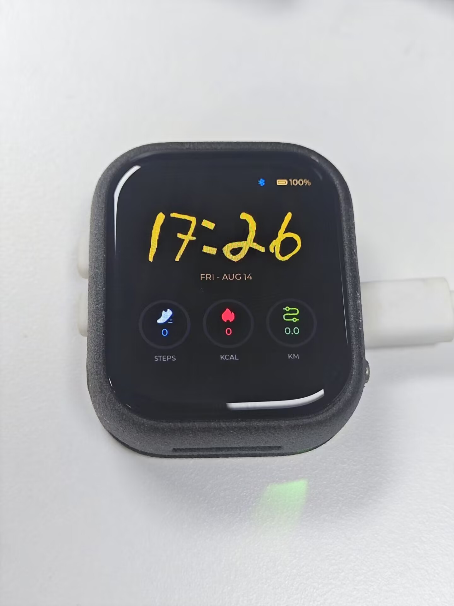
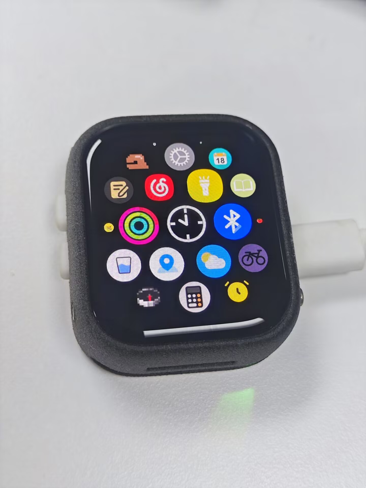
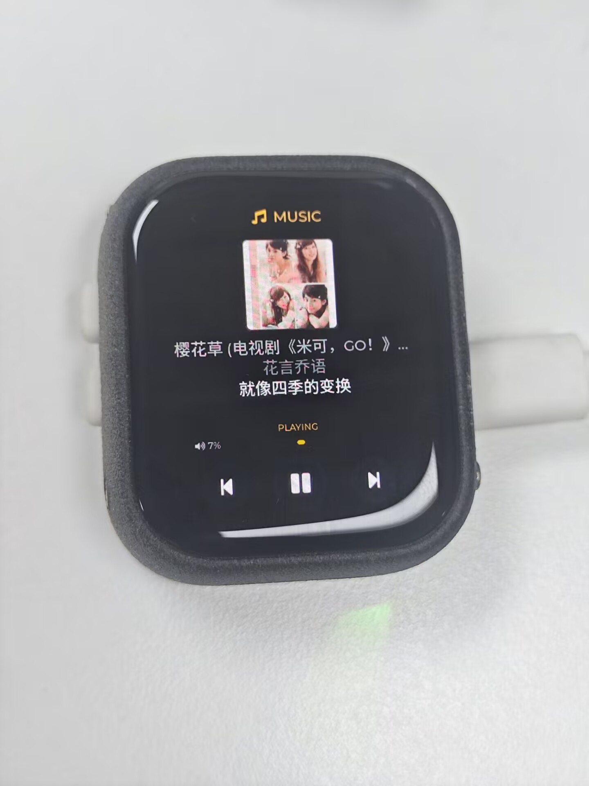

# HSP Watch

基于 SiFli SF32LB52 黄山派开发板的智能手表固件项目。项目面向 390 x 450 椭圆形触摸屏，使用 SiFli SDK v2.5、RT-Thread 与 LVGL v8 构建手表端界面、硬件服务和手机 BLE 配套协议。

当前固件版本：`0.2.0`

## 实机效果

<table>
  <tr>
    <td align="center"></td>
    <td align="center"></td>
    <td align="center"></td>
  </tr>
  <tr>
    <td align="center">图片数字表盘</td>
    <td align="center">动态蜂窝应用菜单</td>
    <td align="center">音乐控制页面</td>
  </tr>
</table>

## 主要交互

### 主页手势

| 操作 | 目标页面 |
| --- | --- |
| 左滑 | 动态蜂窝应用菜单 |
| 右滑 | 音乐页面 |
| 上滑 | 通知列表 |
| 下滑 | 控制中心 |

### 实体按键

| 场景 | KEY1 | KEY2 |
| --- | --- | --- |
| 普通页面短按 | 返回上一级 | 暂无操作 |
| 普通页面长按 | 1.5 秒息屏 | 2 秒打开关机/重启菜单并震动 |
| 音乐页面短按 | 增加音量 | 降低音量 |
| 屏幕关闭时 | 仅唤醒屏幕 | 仅唤醒屏幕 |
| 休眠关机后 | 无开机功能 | 持续按住约 3 秒开机 |

屏幕关闭后的第一次触摸或按键只负责唤醒，不会同时触发原页面操作。

## 已实现功能

### 表盘主页

- 使用透明 PNG 数字资源组合显示 RTC 小时和分钟，并根据每个数字的可见边界动态居中。
- 显示星期、月份和日期。
- 显示电池百分比、充电标志及低电量状态颜色。
- 蓝牙未连接时显示灰色图标，连接后显示蓝色图标。
- 显示步数、卡路里、距离和三个独立颜色的活动进度环。
- 存在未读消息时在左上角显示红点。
- 采用黑色背景、45 px 圆角和适配椭圆屏的安全边距。

### 动态蜂窝应用菜单

- 移植原手表工程的蜂窝布局与 `cell_transform` 动态变换逻辑。
- 23 个图片图标按六边形螺旋排列。
- 支持任意方向拖动、惯性预测、最近图标居中吸附和点击前自动居中。
- 图标靠近屏幕边缘时会动态缩放，并受到椭圆屏安全区域裁剪。
- 已接通音乐、RGB 灯、蓝牙、天气、位置和木鱼页面。
- 世界时钟图标当前作为返回表盘主页的快捷入口。

### 控制中心

- 蓝牙短按开关，长按进入蓝牙设置。
- RGB 灯短按开关，长按进入灯光设置。
- 扬声器静音开关。
- 抬腕亮屏开关。
- 手机查找控制，可开始或停止手机响铃与振动。
- 屏幕亮度滑块，范围为 1% 至 100%。
- 音乐音量滑块，并与 AVRCP 音量状态同步。

### RGB 灯

- 控制 SK6812 RGB 灯实际硬件输出。
- 支持灯光开关、色轮选色、白光快捷选择和 1% 至 100% 亮度调节。
- 支持手动关闭、15 秒、30 秒、1 分钟和 5 分钟自动关闭。
- 支持常亮、呼吸和闪烁三种灯效。
- 开关灯时提供短震反馈。
- 从控制中心进入时返回控制中心，从蜂窝菜单进入时返回蜂窝菜单。

### 音乐控制

- 支持 A2DP/AVRCP 连接状态、播放状态和绝对音量同步。
- 显示曲名、歌手、专辑、当前歌词和播放状态。
- 支持上一首、播放/暂停和下一首控制。
- 支持手机传输 128 x 128 JPEG 封面，最大 8 KiB，并进行 CRC32 校验、分包重组、失败重试和本地文件保存。
- 支持手机歌词分包同步和中文字体显示。
- 保留原生 AVRCP Cover Art 作为配套 App 封面不可用时的回退路径。
- 可从主页或蜂窝菜单进入，并返回对应的上一级页面。

### 通知

- 支持短信、微信、QQ/TIM 三类手机通知。
- 手表端最多缓存 5 条消息，显示来源图标、时间、标题、正文预览和详情。
- 点击通知即标记为已读，但不会自动删除消息。
- 支持单条删除和全部清除，并将删除命令反向同步给配套 App 的消息缓存。
- 新消息到达时短震、亮屏并直接展示该条通知。
- 新消息展示后若 2 秒内没有触摸或按键操作，会返回主页并自动息屏，同时保留未读状态和主页红点。
- 任何触摸或按键操作都会取消本次自动息屏；只有点击通知内容或从列表主动打开消息时才会标记为已读。

### 天气与位置

- 天气页显示手机同步的城市、坐标、WMO 天气状况、当前温度、最高/最低温度和湿度。
- 根据 WMO 天气代码绘制晴天、多云、雾、雨、雪和雷暴图形。
- 位置页显示城市、经纬度、定位精度和最近同步状态。
- 天气和位置页只从蜂窝菜单进入，并返回蜂窝菜单。

### 木鱼

- 点击图片触发按压缩放动画和短震反馈。
- 显示“功德 +1”上浮淡出效果。
- KEY1 或页面返回手势返回蜂窝菜单。

### 电池与充电

- 通过 GPADC 读取电池电压，使用校准、采样过滤、充放电曲线和单次变化限制计算电量。
- 通过 charger detect 和板级检测引脚识别外部电源及充电状态。
- 15% 及以下显示低电量提示。
- 5% 及以下连续确认 3 次后亮屏显示 15 秒关机倒计时，未接入外部电源时自动关机。
- 电量首次从 10% 以上降到 10% 及以下时短震。
- 接入充电和首次检测到充满时短震。
- 电量与充电状态同时发布给标准 BLE Battery Service 和自定义设备状态通道。

### 屏幕、电源与震动

- 15 秒无操作自动将 LCD 亮度降为 0，唤醒后恢复之前的亮度。
- 支持触摸、任一实体按键和 LSM6DSL 抬腕动作唤醒屏幕。
- 提供关机、重启、取消和二次确认界面。
- 关机进入 PMU Hibernate，重启调用系统重启接口。
- 开机、关机、重启、电源菜单、新消息、查找手表、木鱼、RGB 灯和电池状态变化均接入震动反馈。

### 活动数据

- 读取 LSM6DSL 硬件计步器并每秒更新。
- 处理 16 位硬件计数回绕、异常跳变和跨日清零。
- 按每 1000 步约 40 kcal、每步约 0.7 m 估算卡路里和距离。
- 在主页活动环显示，并通过 BLE 设备状态通道同步给配套 App。

## BLE 配套协议

手表作为 BLE Peripheral/GATT Server，手机作为 Central/GATT Client。自定义服务包含以下特征：

| 特征 | 方向 | 用途 |
| --- | --- | --- |
| `CONTROL` | 手机 -> 手表 | 查找手表及停止振动 |
| `STATE` | 手表 -> 手机 | 查找手机、通知删除和清空命令 |
| `SYNC` | 手机 -> 手表 | 时间、时区、位置、城市、天气、通知、歌词和封面同步 |
| `DEVICE_STATUS` | 手表 -> 手机 | 电量、充电状态、固件版本、步数、卡路里和距离 |

- Android 端请求 MTU 247，协商成功后单个 SYNC 写包最大为 244 字节。
- MTU 协商失败时回退到默认 20 字节有效载荷。
- 封面数据使用协商后的 MTU；其他同步命令保留原有分包格式以兼容旧固件。
- 自定义服务当前使用 `NOAUTH` 权限，不应视为已经实现认证或加密的业务通道。

## 表盘图片资源

`image/number/` 保存当前主页、活动状态和通知页面使用的图片。所有 `.png` 文件均为带透明通道的真实 RGBA PNG；三张 `.jpg` 为真机效果照片。

### 数字与冒号

数字 `1` 至 `9` 为 100 x 100，`num_0.png` 当前为 96 x 96，冒号 `point.png` 为 72 x 72。程序会读取图片的透明可见边界，而不是直接按整张画布宽度排列。


## 当前限制

- 蜂窝菜单中的活动、设置、日历、电子书、番茄钟、骑行秒表、闹钟、计算器、指南针、喝水、相机、笔记、相册、录音、保险箱和 SOS 当前只有图标、拖动与点击反馈，没有实际应用页面。
- 控制中心的低电量模式目前只改变 UI 状态，尚未接入实际省电策略。
- 位置页面是坐标信息和静态示意图，不包含地图瓦片、路线规划或导航。
- 蓝牙设置中的 PAN 开关只保存页面内偏好；底层 PAN/NTP 代码已存在，但尚未完整接入该开关。
- 连接新手机、移除配对、清除配对、通话和部分蓝牙诊断入口仍为预留。
- 活动累计和 RGB 参数仅保存在 RAM 中，重启后不会恢复。
- 歌词依赖手机通知读取权限、活跃媒体会话和网络；封面依赖播放器提供 artwork。

## Android 配套 App

Android 配套 App 位于独立项目 `hsp/`，负责连接与重连手表、双向查找、手机数据同步、通知转发以及歌词和封面传输。Android 端有独立的实现说明，详见 [LCHSP_Watch_App](https://github.com/Gangan-307/LCHSP_Watch_App)。本 README 以手表固件为主，不展开 App 页面和权限细节。

## 工程结构

```text
src/app/                 固件启动与服务初始化
src/bluetooth/           BLE 自定义服务、Battery Service、音乐与 PAN
src/drivers/             ADC、显示电源、RGB 灯和震动驱动
src/services/            电池、计步、通知、手机同步、按键和电源服务
src/ui/app_grid/         动态蜂窝应用菜单
src/ui/details/          天气与位置详情页
src/ui/music/            音乐控制页
src/ui/system/           关机与重启界面
src/ui/generated/        SquareLine 页面及大量手工扩展逻辑
image/app_grid/          蜂窝菜单应用图标
image/number/            表盘数字、状态图标、通知图标和实机照片
project/                 SiFli SDK SCons 构建配置
hsp/                     独立 Android 配套 App 项目
```

`src/ui/generated/` 中包含大量手工扩展代码，不能直接整体重新生成或覆盖。

## 构建固件

推荐使用 VSCode + SiFli SDK 插件打开 `project/` 下的 HCPU 构建配置。命令行构建前需要先在 SiFli SDK 根目录执行 `set_env.bat`，并确保 `SIFLI_SDK` 指向 SiFli SDK v2.5。

```bash
cd project
scons --board=sf32lb52-lchspi-ulp_hcpu
```

构建成功后，主要固件文件位于：

```text
project/build_sf32lb52-lchspi-ulp_hcpu/main.bin
```

实际命令可能随 SDK 安装方式和 VSCode 插件配置不同，以本地 SiFli SDK 环境为准。

## 说明

- 项目当前固件面向 SiFli SDK v2.5 和 LVGL v8，不使用 LVGL v9 API。
- 中文通知和歌词复用项目内 `hsp_font_cjk_22` 字体。
- 芯片或 SDK 支持的能力不代表已经接入本项目，请以“已实现功能”和“当前限制”为准。
- 项目当前未声明开源许可证。

## 固件更新记录

| 固件版本 | 更新日期 | 主要修改 |
| --- | --- | --- |
| `0.2.0` | 2026-08-14 | 完善动态蜂窝菜单、图片数字表盘、应用页面导航、实体按键、电源管理、通知、音乐、活动数据、充电状态与震动反馈。 |
| `0.1.0` | 2026-08-07 | 建立手表固件基础功能，接入 BLE 状态同步及基础 LVGL 页面。 |
