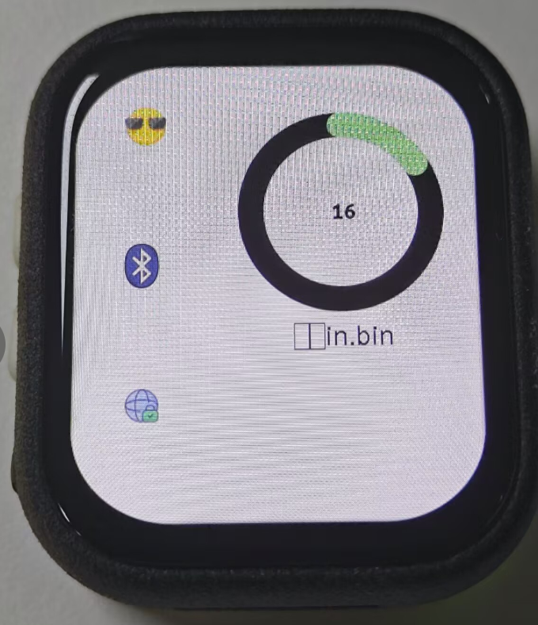
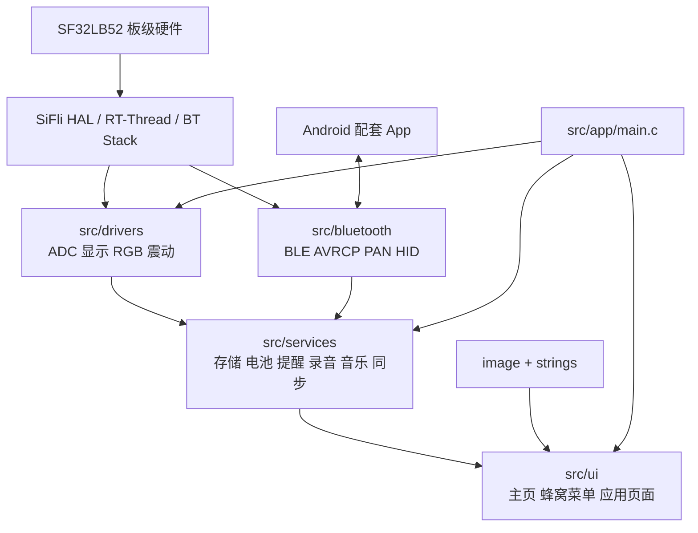

# HSP Watch

基于 SiFli SF32LB52 黄山派开发板的智能手表固件。项目面向 390 x 450
椭圆形触摸屏，使用 SiFli SDK v2.5、RT-Thread 和 LVGL v8.3.11，包含手表
UI、板载硬件服务、TF 卡应用、经典蓝牙音频控制和 Android BLE 配套协议。

当前对外固件版本：`0.4.1`

## 项目概览

| 项目 | 当前配置 |
| --- | --- |
| 芯片/开发板 | SiFli SF32LB52 / `sf32lb52-lchspi-ulp_hcpu` |
| 屏幕 | 390 x 450 CO5300 椭圆形触摸屏 |
| SDK | SiFli SDK v2.5 |
| 系统 | RT-Thread |
| GUI | LVGL v8.3.11 + `littlevgl2rtt` |
| 构建系统 | SiFli SDK SCons |
| 存储 | 内部 NOR FAT 文件系统 + SPI TF 卡 FAT 文件系统 |
| 蓝牙 | BLE GATT、Battery Service、A2DP/AVRCP、PAN、HID |
| 音频 | 本地 MP3/WAV 播放、麦克风 WAV 录音、蓝牙音乐控制 |

## 实机效果

<table>
  <tr>
    <td align="center"></td>
    <td align="center"></td>
    <td align="center"></td>
  </tr>
  <tr>
    <td align="center">图片数字表盘</td>
    <td align="center">动态蜂窝应用菜单</td>
    <td align="center">音乐控制页面</td>
  </tr>
</table>

## 功能状态

| 模块 | 状态 | 说明 |
| --- | --- | --- |
| 表盘、控制中心、通知 | 已实现 | RTC、电量、活动环、手势导航和通知详情 |
| 蜂窝应用菜单 | 已实现 | 23 个图标、惯性拖动、缩放和自动吸附 |
| 系统设置与电源管理 | 已实现 | 亮度、息屏、抬腕、音量、震动、关机和重启 |
| 闹钟、日历、计算器 | 已实现 | 包含持久化、农历/节日和连续运算 |
| 喝水提醒、番茄钟 | 已实现 | 后台计时、震动提醒和配置持久化 |
| 运动、RGB 灯、指南针 | 已实现 | 运动页显示步数、卡路里和距离，对接 LSM6DSL、SK6812 和 MMC56X3 |
| TF 文件管理 | 已实现 | 目录浏览、排序、文件大小、文本预览和插拔自动刷新，只读 |
| TF 录音 | 已实现 | 16 kHz 单声道 PCM WAV，支持列表、回放、删除和异常拔卡保护 |
| 音乐 | 已实现双模式 | TF 卡 MP3/WAV 播放和手机 AVRCP 控制，本地播放与录音互斥 |
| 手机通知、天气、位置 | 依赖配套 App | 通过自定义 BLE GATT 协议同步 |
| 遥控拍照 | 依赖手机 HID | 支持立即、3 秒和 5 秒倒计时快门 |
| 音乐封面、照片预览 | 已实现 | BLE JPEG 接收、固定工作区 RGB565 解码、缩放和照片拖动预览 |
| PAN/NTP | 部分实现 | 底层连接和 NTP 已接入，设置页 PAN 偏好尚未完整驱动服务 |
| 主固件 PAN OTA | 已实现并已配置 | 设置页/App 检查更新，手表通过手机 PAN 联网，独立 DFU Loader 下载、校验并写入主固件 |

## 快速开始

### 1. 环境准备

- Windows 10/11。
- SiFli SDK v2.5 和配套 ARM GCC/SCons 工具链。
- VSCode + SiFli SDK 插件，或已执行 SDK `set_env.bat` 的命令行。
- 黄山派 SF32LB52 ULP 开发板及可用串口/下载器。

命令行构建前，确认 `SIFLI_SDK` 已指向 SDK v2.5 根目录：

```bat
cd D:\path\to\SiFli-SDK-V2.5
set_env.bat
```

### 2. 编译主固件

```bash
cd project
scons --board=sf32lb52-lchspi-ulp_hcpu -j8
```

构建成功后，主要产物位于：

```text
project/build_sf32lb52-lchspi-ulp_hcpu/main.bin
project/build_sf32lb52-lchspi-ulp_hcpu/dfu/dfu.bin
project/build_sf32lb52-lchspi-ulp_hcpu/bootloader/bootloader.bin
project/build_sf32lb52-lchspi-ulp_hcpu/ftab/ftab.bin
project/build_sf32lb52-lchspi-ulp_hcpu/main.elf
project/build_sf32lb52-lchspi-ulp_hcpu/download.bat
project/build_sf32lb52-lchspi-ulp_hcpu/uart_download.bat
```

`main.bin` 只是 HCPU 应用镜像。OTA 分区表与旧版本不同，首次部署 `0.4.1` 时必须
使用 SDK 生成的完整下载脚本，一次烧录 `ftab + bootloader + dfu + main`。只烧
`main.bin` 无法建立 OTA Loader，且主固件地址也会与旧分区表不一致。

### 3. 烧录

进入构建目录后，根据本机连接方式使用 SiFli 下载脚本：

```bat
cd project\build_sf32lb52-lchspi-ulp_hcpu
uart_download.bat
```

也可以使用 VSCode SiFli 插件的 Download/Flash 操作。串口号、下载模式和驱动安装
以本地 SDK 快速入门文档为准。

### 4. 准备 TF 卡

1. 建议使用 PC 格式化为 FAT/FAT32 的 TF 卡，当前不建议使用 exFAT。
2. 在卡根目录创建 `music` 文件夹，并放入 `.mp3` 或 `.wav` 文件。
3. `record` 文件夹无需手工创建，首次录音时会自动创建。
4. 从蜂窝页进入音乐应用，选择“TF卡”并开始播放。
5. 当前“骑行秒表”图标临时作为 TF 文件管理器入口。

标准 PC FAT 分区会优先直接挂载；如果挂载失败，代码会兼容 `spi_tf` 参考项目的
固定偏移双卷布局。已挂载时后台每秒探测一次 TF 卡，连续两次失败后按拔卡处理；
无卡时使用低优先级线程每 30 秒尝试一次自动重挂载，进入 TF 相关页面或点击刷新会
立即提交异步挂载请求，避免 SDK 最长数秒的无卡初始化阻塞 LVGL。

### 5. 配置主固件 OTA

当前主固件已启用 PAN OTA，并在 `project/proj.conf` 中配置项目服务器：

<p align="center">
  
  <br>
  OTA 固件升级进度
</p>

```text
CONFIG_HSP_USING_OTA=y
CONFIG_HSP_OTA_SERVER_BASE_URL="https://47-76-221-194.sslip.io"
```

版本查询地址由主固件自动拼接为：

```text
https://47-76-221-194.sslip.io/v2/example/pan_ota/
SF32LB52_ULP_NOR_TFT_CO5300/sf32lb52-lchspi-ulp
?chip_id=<手表生成的客户端 ID>&version=latest
```

#### OTA 实现流程

1. 用户在手表设置页或 Android App 中发出“检查更新”命令。
2. `src/services/ota_service.c` 的独立 RT-Thread 工作线程通过手机蓝牙 PAN 查询 HTTPS
   版本接口，不在 LVGL 线程中执行网络请求。
3. 主固件比较服务器版本并校验升级清单，将合法的镜像信息写入内部 Flash。
4. 用户确认安装后，主固件检查 PAN、电量和本地音频状态，设置升级标志并重启。
5. `project/dfu_pan_loader/` 启动后重新通过 PAN 下载 `main.bin`，校验大小和 CRC32，
   再将镜像写入主固件分区 `0x12218000`。
6. Loader 校验通过后清除升级状态并启动新的主固件。

Android App 只通过 BLE 发送检查/安装命令、接收 OTA 状态和打开系统网络共享设置，
不接收或中转固件文件。版本查询与固件下载都由手表使用手机 PAN 网络直接完成。

#### 清单格式与校验

服务端响应需兼容 SiFli `dfu_pan` 格式。下面是 `0.4.1` 的结构示例，其中
`file_size` 和 `crc32` 必须替换为本次实际生成的 `main.bin` 参数：

```json
{
  "result": 200,
  "data": [
    {
      "name": "v0.4.1",
      "files": [
        {
          "file_id": 1,
          "file_name": "main.bin",
          "url": "https://47-76-221-194.sslip.io/releases/0.4.1/main.bin",
          "addr": "0x12218000",
          "file_size": 4496204,
          "crc32": "0xd0a45804",
          "region_size": "0x00788000"
        }
      ]
    }
  ]
}
```

主固件只接受一个有效镜像，且清单必须满足：

- `file_name` 为 `main.bin`。
- `addr` 为 `0x12218000`。
- `file_size` 大于 0 且不超过 `region_size`。
- `region_size` 不超过 `0x00788000`。
- `url` 使用 HTTPS，`crc32` 与发布的 `main.bin` 一致。

本项目的 OTA CRC32 初值为 `0xffffffff`，不能直接使用默认初值为 0 的普通 CRC32
工具。进入构建目录后可用以下命令同时得到文件大小和清单所需 CRC：

```bash
python3 -c "import zlib; d=open('main.bin','rb').read(); print(len(d), '0x%08x' % zlib.crc32(d, 0xffffffff))"
```

#### 发布 `0.4.1`

1. 确认 `src/bluetooth/find_phone_ble.h` 中的
   `HSP_WATCH_FIRMWARE_VERSION` 为 `0.4.1`，然后执行完整构建。
2. 将 `project/build_sf32lb52-lchspi-ulp_hcpu/main.bin` 上传到服务器，例如
   `/releases/0.4.1/main.bin`；该 URL 必须可通过 HTTPS 直接下载，不能返回登录页。
3. 使用上面的命令计算上传文件的实际大小和 OTA CRC32，并同步更新服务器清单。
4. 将清单版本设置为 `v0.4.1`，确认下载地址、Flash 地址和区域大小无误后再发布。
5. 分别访问版本查询 URL 和固件 URL，确认返回 HTTP 200，且服务器文件大小与清单一致。

同一版本不会触发升级：运行 `0.4.1` 的手表只有在服务器 `name` 高于 `v0.4.1` 时才会
显示新版本。重新发布有代码变化的固件时应递增版本号，不能只覆盖同名文件。

#### 运行条件与稳定性保护

- 手表已连接手机，手机已开启蓝牙网络共享且自身可以访问互联网。
- TF 音乐和录音均已停止；本地音频被占用时安装请求会被拒绝。
- 电量不低于 40%，或者手表正在使用外部电源。
- 查询前系统堆剩余空间不少于 20 KB，否则 OTA 会返回内存不足而不会继续请求。
- 主固件和 Loader 的 MbedTLS 都使用 96 KB PSRAM 专用 memheap；分配失败不会回退并
  挤占 LVGL/系统堆。
- 固件仅内置当前服务器证书链所需的 ISRG Root X1 根证书，服务器更换 CA 后需同步更新
  `project/ota_client/hsp_tls_certificate.c`。
- 从设置页或蓝牙页返回蜂窝页时会销毁原 LVGL 页面，避免 OTA 内存压力后继续保留页面树。

#### 真机验证

首次验证 OTA 分区时，必须先通过下载器完整烧录 `ftab + bootloader + dfu + main`。
只烧录 `main.bin` 不会安装修正后的 Loader。启动后串口应出现：

```text
ota_tls: PSRAM pool ready, 98304 bytes
```

手机连接手表并开启蓝牙网络共享后，在设置页进入系统更新并点击“检查更新”。查询过程
应出现以下堆日志，页面仍可正常刷新：

```text
ota: heap before query total=... used=... free=... peak=...
ota: heap after query total=... used=... free=... peak=...
```

发现高版本后点击安装，手表应重启进入 DFU PAN Loader，完成下载、CRC 校验和写入后
自动启动主固件。最后在设置页确认版本号，并再次检查更新验证“当前已是最新版本”。

常见失败定位：

- 一直提示网络失败：检查手机 PAN、DNS、HTTPS 证书链和版本接口是否返回 HTTP 200。
- 提示清单无效：检查是否仅有一个 `main.bin`，以及地址、大小、区域和 HTTPS URL。
- Loader 报 CRC 错误：重新对服务器上的文件计算带 `0xffffffff` 初值的 CRC，避免只
  计算本地文件后又上传了不同版本。
- 重启后未进入下载：通常是设备只烧过 `main.bin`，需要重新完整烧录含 `dfu.bin` 的固件。

## 主要交互

### 主页手势

| 操作 | 目标页面 |
| --- | --- |
| 左滑 | 动态蜂窝应用菜单 |
| 右滑 | 音乐页面 |
| 上滑 | 通知列表 |
| 下滑 | 控制中心 |

### 实体按键

| 场景 | KEY1 | KEY2 |
| --- | --- | --- |
| 普通页面短按 | 返回上一级 | 暂无操作 |
| 普通页面长按 | 1.5 秒息屏 | 2 秒打开关机/重启菜单并震动 |
| 音乐页面短按 | 增加音量 | 降低音量 |
| 屏幕关闭时 | 仅唤醒屏幕 | 仅唤醒屏幕 |
| 休眠关机后 | 无开机功能 | 持续按住约 3 秒开机 |

屏幕关闭后的第一次触摸或按键只负责唤醒，不会同时触发原页面操作。

## 核心功能

### 表盘与蜂窝菜单

- 使用透明 PNG 数字资源组合显示 RTC 时间，并根据透明可见区域动态居中。
- 显示日期、电量、充电状态、蓝牙状态、步数、卡路里、距离和三色活动环。
- 存在未读消息时显示红点。
- 23 个应用图标按六边形螺旋排列，支持任意方向拖动、惯性预测、最近图标吸附、
  点击前自动居中和椭圆屏边缘缩放。
- 世界时钟图标当前作为返回主页的快捷入口。

### 控制中心与设置

- 蓝牙、RGB 灯、静音、抬腕亮屏和查找手机快捷开关。
- 屏幕亮度和音乐音量滑块。
- 设置页提供息屏时间、震动、勿扰、低电量模式、电池信息和系统信息。
- 设置保存到 `/watch_settings.bin`，重启后自动恢复。
- 支持关机、重启和二次确认；关机进入 PMU Hibernate。

### TF 文件管理

- 通过 SPI MSD + DFS ElmFat 挂载 TF 卡，正常路径为 `/tf`。
- 文件夹优先、名称排序，单次最多显示 80 个条目。
- 支持进入子目录、返回上级、刷新、显示文件大小。
- 文本文件预览前 2048 字节；检测到明显二进制内容时只显示提示。
- 当前为只读浏览器，不支持新建、复制、移动、重命名或删除。

### 录音

- 从蜂窝菜单“录音”进入，点击主按钮开始或停止录音。
- 使用板载麦克风录制 16 kHz、单声道、16-bit PCM WAV。
- 文件保存到 TF 卡 `/record`，命名格式为
  `REC_YYYYMMDD_HHMMSS.wav`，重名时自动追加序号。
- 停止录音时回写 WAV 头并 `fsync`，空录音或失败文件会被清理。
- 页面按时间倒序列出最近 12 条录音，显示时长并支持播放/停止。
- 当前不支持在手表端删除或重命名录音。

### 音乐

音乐页提供“TF卡”和“蓝牙”两种互斥模式：

- TF 模式扫描 `/music` 目录下的 `.mp3` 和 `.wav`，按文件名排序，最多 64 首。
- 支持上一首、播放/暂停、下一首、自动下一首、进度、总时长和本地音量。
- 当前只扫描 `music` 根目录，不递归扫描子文件夹。
- 蓝牙模式同步 A2DP/AVRCP 连接、播放状态、曲名、歌手、专辑、进度和绝对音量。
- 支持上一首、播放/暂停、下一首和音量控制。
- 配套 App 可分包传输歌词及最大 8 KiB、128 x 128 的 JPEG 封面，包含 generation、
  CRC32、超时和重试校验；封面保存到内部存储 `/cover.jpg`。
- 原生 AVRCP Cover Art 保留为配套 App 不可用时的回退路径。

### 通知与手机数据

- 支持短信、微信、QQ/TIM 通知，手表端最多缓存 5 条。
- 显示来源、时间、标题、正文预览和详情，支持单条删除和全部清除。
- 删除操作会反向同步到配套 App 的缓存。
- 新消息到达时震动、亮屏并展示；无操作后返回主页并保留未读状态。
- 手机同步城市、经纬度、天气代码、温湿度、歌词、封面和最近照片。

### 闹钟、喝水与番茄钟

- 最多 5 个闹钟，支持一次、每天、工作日和自定义星期重复。
- 到点后亮屏并周期震动，可关闭或稍后 5 分钟。
- 喝水提醒支持时间范围、30 分钟至 6 小时间隔、每日目标和稍后提醒。
- 番茄钟支持专注/短休息/长休息、自定义时长和今日统计。
- 配置分别持久化到 `/alarm_config.bin`、`/water_config.bin` 和
  `/tomato_config.bin`。

### 日历、计算器与木鱼

- 日历覆盖 2000 至 2099 年，包含农历干支、农历日期、ISO 周数和节日。
- 计算器支持四则运算、百分比、小数、连续运算、实时预计算和退格。
- 木鱼支持点击缩放、短震和“功德 +1”上浮动画。

### 遥控拍照与指南针

- 通过蓝牙 HID 控制手机系统相机，支持立即、3 秒和 5 秒倒计时。
- 配套 App 可将最近照片压缩后分包回传，最大 16 KiB、最长边 160 px，保存到
  `/camera.jpg`。
- 预览页设计了缩放、平移和适配显示；JPEG 真机解码仍在联调。
- 指南针以 20 Hz 读取 MMC56X3，显示航向、八方位、磁场强度、校准进度和干扰状态。

### 电池、活动与电源

- GPADC 电压采样结合充放电曲线、滤波和变化限制计算电量。
- 识别外部电源和充电状态，提供低电提醒、5% 自动关机倒计时和充电震动反馈。
- LSM6DSL 硬件计步器每秒更新，处理 16 位回绕、异常跳变和跨日清零。
- 按每 1000 步约 40 kcal、每步约 0.7 m 估算活动数据。
- 电量、充电、步数、卡路里和距离同时发布给 BLE 服务和主页 UI。

## 存储布局

### 内部 NOR

主固件将分区表中的 4 MiB `FS_REGION` 注册为 MTD 设备 `musicfs`，挂载到 `/`。
首次启动时如果没有有效 FAT 文件系统，会格式化该内部区域后重新挂载。该操作不会
格式化 TF 卡。

内部文件系统当前保存：

```text
/watch_settings.bin
/alarm_config.bin
/water_config.bin
/tomato_config.bin
/cover.jpg
/camera.jpg
```

内部 NOR 擦除扇区为 4096 字节，因此 `project/proj.conf` 必须保持：

```text
CONFIG_RT_DFS_ELM_MAX_SECTOR_SIZE=4096
```

该最大值同时兼容 TF 卡常见的 512 字节逻辑扇区。

### TF 卡

```text
/tf/                    标准 FAT 卡挂载点
/tf/music/              MP3/WAV 音乐
/tf/record/             手表录音
/tf/misc/               仅旧版 spi_tf 双卷布局可能存在
```

当内部根文件系统不可用时，TF 卡会回退挂载到 `/`，此时音乐和录音路径分别为
`/music`、`/record`。

## BLE 配套协议

手表作为 BLE Peripheral/GATT Server，手机作为 Central/GATT Client。自定义服务包含：

| 特征 | 方向 | 用途 |
| --- | --- | --- |
| `CONTROL` | 手机 -> 手表 | 查找手表及停止振动 |
| `STATE` | 手表 -> 手机 | 查找手机、通知管理、拍照和照片预览请求 |
| `SYNC` | 手机 -> 手表 | 时间、位置、天气、通知、歌词、封面和照片同步 |
| `DEVICE_STATUS` | 手表 -> 手机 | 电量、充电、固件版本、步数、卡路里和距离 |

- Android 端请求 MTU 247，协商后 `SYNC` 单包有效载荷最大 244 字节。
- MTU 协商失败时回退到默认 20 字节有效载荷。
- 封面和照片采用 begin/data + generation + offset + CRC32 的分包模型。
- 自定义服务当前使用 `NOAUTH` 权限，不应视为已实现业务层认证或加密。

Android 配套 App 在本地开发环境中位于 `hsp/`，该目录不随本仓库发布。公开项目见
[LCHSP_Watch_App](https://github.com/Gangan-307/LCHSP_Watch_App)。

## 软件架构



主线程负责固定顺序初始化和 `lv_timer_handler()` 循环；音频、蓝牙、TF 音乐、录音
播放、传感器和提醒任务由 RT-Thread 线程、timer、mailbox 或消息队列驱动。多个服务
通过 snapshot + mutex 向 UI 暴露状态。

## 工程结构

```text
src/app/                 固件入口和服务初始化
src/bluetooth/           BLE 自定义协议、Battery Service、音乐、PAN/HID
src/drivers/             ADC、显示电源、RGB 灯和震动驱动
src/services/            存储、TF、音频、提醒、同步、电池、活动和电源服务
src/ui/alarm/            闹钟
src/ui/activity/         今日步数、卡路里和距离
src/ui/app_grid/         动态蜂窝应用菜单
src/ui/calculator/       计算器
src/ui/calendar/         公历、农历和节日
src/ui/camera/           遥控拍照和照片预览
src/ui/compass/          三轴地磁指南针
src/ui/details/          天气和位置详情
src/ui/music/            TF/蓝牙双模式音乐页
src/ui/record/           TF 录音页
src/ui/tf_file_manager/  TF 文件管理器
src/ui/settings/         系统设置、电池管理和系统信息
src/ui/system/           关机和重启界面
src/ui/tomato/           番茄钟
src/ui/water/            喝水提醒
src/services/ota_service.c  主固件 OTA 状态机、条件和清单校验
src/ui/generated/        SquareLine 代码及现有手工扩展
src/resource/strings/    中英文资源 JSON
image/                   LVGL 图片和实机照片资源
project/                 主固件 SCons 工程
project/dfu_pan_loader/  独立 PAN 下载与刷写 Loader
project/ota_client/      主固件使用的 SDK PAN 客户端包装层
simulator/               Windows/MSVC LVGL 模拟器工程
mp3_sd_player/           SDK TF 音乐移植参考工程
pan_ota/                 SDK PAN OTA 独立参考工程
docs/                    架构、调试和问题分析文档
```

`src/SConscript` 是主固件源码清单的权威入口。`src/CMakeLists.txt` 和
`src/filelist.txt` 尚未覆盖全部新增模块，不应替代 SCons 判断实际编译内容。

`src/ui/generated/` 中已经混入较多手工扩展，不能直接用 SquareLine 整体覆盖。

## 独立示例工程

### `mp3_sd_player/`

SiFli 本地音乐示例的移植参考，用于验证 SPI MSD、ElmFat、Audio Manager 和
`audio_mp3ctrl`。主固件已提取并重写所需逻辑，日常开发不需要编译该目录。

### `pan_ota/`

SiFli PAN OTA 示例，包含手机蓝牙网络共享、设备注册、版本查询和 DFU PAN 下载流程。
它仍是独立参考工程，不参与主固件构建。主项目已提取版本查询客户端，并通过
`project/dfu_pan_loader/` 单独构建 LVGL v9 Loader，避免与主固件 LVGL v8 混编。

## 常见问题

### `Cannot create /tf: -2` 或 TF 挂载失败

- 确认内部文件系统先成功挂载到 `/`，启动日志应包含 `storage:`。
- 确认 TF 卡已格式化为 FAT/FAT32，并能被 PC 正常读取。
- 确认 `sd0` SPI MSD 设备已经创建。
- 当前代码会先尝试整卡 FAT，再尝试 `spi_tf` 的固定偏移布局。

### `storage: mount failed, errno=0`

检查生成配置中的 `RT_DFS_ELM_MAX_SECTOR_SIZE` 是否为 `4096`。内部 NOR 的扇区大于
FatFs 最大扇区配置时，挂载会在进入 `f_mount()` 前失败，错误码可能仍为 0。

### `struct dirent`、`DIR` 或 `opendir` 重定义

RT-Thread DFS 和 newlib 都可能提供 `dirent` 定义。项目文件应使用 SDK 的
`dfs_file.h`/`dfs_posix.h`，不要再同时包含标准库 `<dirent.h>`。

### 日志显示封面已保存，但界面仍无封面

`music: phone cover saved` 表示 BLE、CRC 和文件写入已经成功。若随后只看到
`music: cover decode failed`，应继续根据其后的格式错误、尺寸超限或内存日志排查。
当前封面使用固定 4 KB 工作区解码到 128 x 128 RGB565 缓冲，再缩放到 184 x 184。

### NTP 一直提示 DNS 解析失败

确认手机已开启蓝牙网络共享、PAN profile 已连接，并且手机本身可以联网。设置页的
PAN 偏好目前不会完整建立连接，可通过 FinSH 执行 `pan_cmd conn_pan` 进行调试。

## 当前限制

- 蜂窝菜单中的电子书、笔记、相册和 SOS 仍只有图标或点击反馈。
- “骑行秒表”当前临时打开 TF 文件管理器，尚未实现骑行计时。
- 保险箱当前只进入动态 GIF 展示页，没有密码、加密或数据保管能力。
- TF 文件管理器为只读；录音页支持删除，但暂不支持重命名和分享。
- TF 音乐只扫描 `/music` 第一层，最多 64 首，不读取专辑封面或 ID3 元数据。
- TF 热插拔使用 SPI 扇区健康探测，没有独立卡检测引脚，拔卡确认最长约 2 秒。
- 蓝牙设置中的 PAN 开关只保存页面内偏好，底层 PAN/NTP 尚未完整受该开关控制。
- OTA 当前仅升级本开发板的 `main.bin`；服务端证书、分区地址和清单格式必须与固件配置一致。
- 连接新手机、移除单个配对、清除全部配对、通话和部分蓝牙诊断入口仍为预留。
- 位置页是坐标信息和静态示意图，不包含地图瓦片、路线规划或导航。
- 活动累计和 RGB 参数仍主要保存在 RAM，重启后不会完整恢复。
- 番茄钟运行中的倒计时不会跨设备重启恢复，提示音尚未接入实际资源。
- 指南针是水平面二维航向计算，倾斜佩戴会产生误差，每台设备需要真机校准。
- 模拟器不能替代 TF、音频、蓝牙、传感器和电源管理的真机测试。
- 项目当前未声明开源许可证。

## 开发注意事项

- 主固件只使用 LVGL v8 API，不要混用 LVGL v9 接口。
- 手工修改文件使用 LF 行尾，避免 Windows CRLF 让整个配置文件产生无效 diff。
- 修改 `project/proj.conf` 后应检查生成的 `.config` 和 `rtconfig.h`，必要时执行全量构建。
- 新增模块时更新 `src/SConscript` 的目录列表；如需模拟器/IDE 支持，再同步辅助清单。
- BLE 协议改动必须同步 Android App，并考虑旧版本 MTU 和包格式兼容。
- 内部存储格式化只允许作用于 `FS_REGION`，不能对 TF 卡或其它 flash 分区自动格式化。
- `src/ui/generated/` 不能无审查重新生成；先确认哪些文件含手工业务逻辑。

进一步的架构分析见 [代码架构分析与优化方向](docs/代码架构分析与优化方向.md)。
LVGL 启动和并发问题可参考：

- [LVGL 屏幕不亮问题分析与修复](docs/LVGL屏幕不亮问题分析与修复.md)
- [LVGL semaphore 崩溃调试记录](docs/debug-lvgl-semtake-crash.md)

## 更新记录

| 固件版本 | 日期 | 主要修改 |
| --- | --- | --- |
| `0.4.1` | 2026-09-07 | 稳定主固件 PAN OTA：版本查询移入独立工作线程，主固件与 DFU Loader 使用 96 KB PSRAM 专用 TLS 内存池，精简为 ISRG Root X1 根证书，增加系统堆余量保护与查询前后日志；修复设置页、蓝牙页返回蜂窝页后的 LVGL 页面生命周期问题，并配置项目 HTTPS OTA 服务。 |
| `0.4.0` | 2026-09-03 | 增加 TF 文件管理、TF WAV 录音、TF/蓝牙双模式音乐和 TF 稳定化；音乐封面与照片预览改用固定 4 KB 工作区解码至 RGB565；正式接入设置页、Android App 和独立 DFU PAN Loader 的主固件 OTA 流程。 |
| `0.3.0` | 2026-08-21 | 新增闹钟、计算器、喝水提醒、番茄钟、日历、遥控拍照、图片预览、指南针和系统设置。 |
| `0.2.0` | 2026-08-14 | 完善蜂窝菜单、图片表盘、导航、实体按键、电源、通知、音乐、活动、充电和震动反馈。 |
| `0.1.0` | 2026-08-07 | 建立手表固件基础功能，接入 BLE 状态同步和基础 LVGL 页面。 |

## 许可证

仓库当前没有根级许可证文件。部分 SiFli 示例源文件保留其原有 Apache-2.0 文件头，
这不等同于整个项目已经按 Apache-2.0 发布。在补充正式 `LICENSE` 前，请勿假定仓库
整体具备明确的再分发授权。
