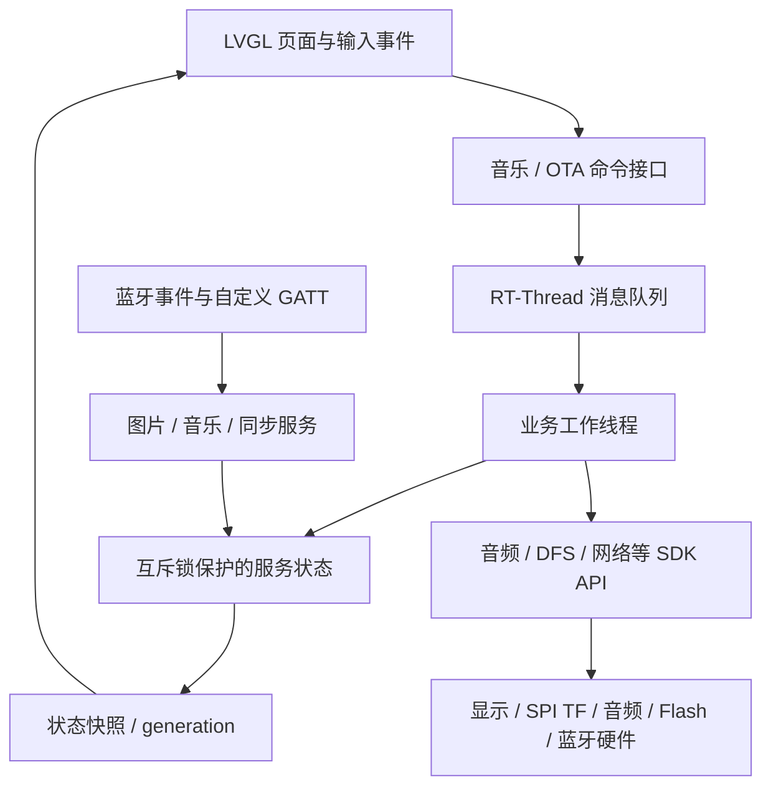
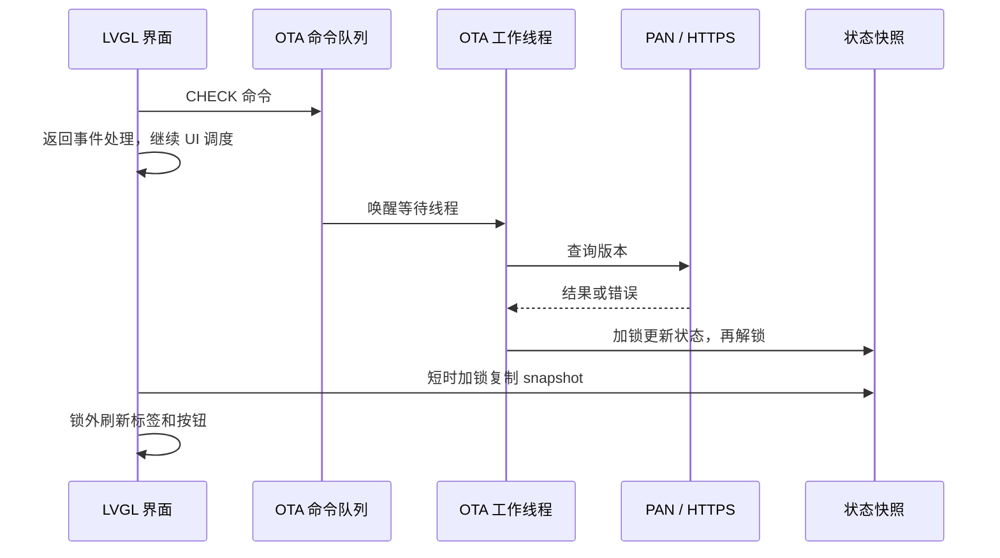
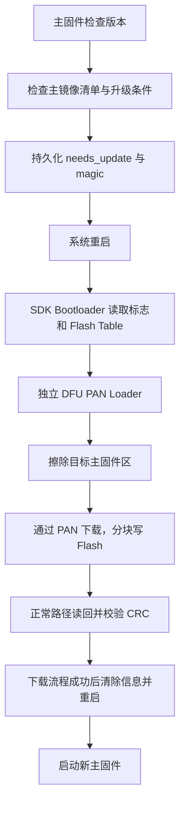

# HSP Watch 项目讲解报告：校招简历与嵌入式面试

整理日期：2026-09-18。面向嵌入式软件、MCU、RTOS 和固件工程师校招。

本文围绕 RTOS、内存、蓝牙及 OTA/Bootloader 展开，App 仅作为通信配套背景。
建议先读第 2～4 节准备简历和口述，再用第 5～9 节准备技术追问。

快速导航：

- [一句话简介与简历内容](#2-一句话简介与简历内容)
- [2 分钟口述](#3-面试-2-分钟版)与 [5～10 分钟口述](#4-面试-5-至-10-分钟详细版)
- [架构和业务流程](#5-架构和核心业务流程)与[关键亮点](#6-关键亮点逐项展开)
- [六类故障案例](#7-故障案例按排查过程讲清楚)
- [37 个面试追问](#8-常见面试追问及回答)
- [量化指标与补测方法](#9-可量化指标与补测方法)
- [当前限制与源码索引](#10-当前限制证据索引与面试准备)

## 1. 项目定位与事实边界

### 1.1 已确认的个人背景

- 项目性质：个人学习项目，代码已公开到 GitHub，目前没有外部用户使用规模的证据。
- 硬件来源：购买 SiFli SF32LB52 黄山派开发板，增加外设焊接和连接；不是自行设计整块主板。
- 主要工作：基于 SDK 示例进行移植修改、模块集成、界面接入、问题排查和真机验证。
- 验证现状：作者于 2026-09-18 确认当前功能已在真机验证通过，且已实际完成过 OTA 更新。
- 服务器：作者在 AI 辅助下完成部署、固件上传和升级验证；不包装成独立开发云端升级平台。
- 技术主线：RT-Thread 多任务组织、资源受限下的内存管理、蓝牙功能集成和固件升级流程。

项目地址：<https://github.com/Gangan-307/LCHSP_Watch>。

项目周期需要补充。仓库最早提交日期为 2026-06-29，这只能证明提交时间，不能代替实际开始日期。
当前源码版本宏为 `0.4.2`，根 README 的对外版本说明仍为 `0.4.1`；口述时可以省略版本号，
演示前以实际烧录固件为准。

### 1.2 报告的证据标记

| 标记 | 含义 | 如何使用 |
| --- | --- | --- |
| 代码确认 | 当前源码或提交历史可以直接核对 | 可描述已实现的机制，不自动等于所有异常场景通过 |
| 日志确认 | 有串口日志或前次测试记录 | 可以引用具体值，但保留测试条件 |
| 作者确认 | 本次交流确认的职责或真机结果 | 可写成功能验证经历，不扩展成未经记录的性能指标 |
| 合理推测 | 能解释现象，但缺少当次完整日志或现场 | 面试中讲为分析方向，不讲成唯一根因 |
| 需要补充 | 缺少时间、测量或操作记录 | 不填入虚构数字，不写成已完成 |

以下口述稿使用第一人称，表示对项目集成和调试的负责范围，不表示每一行代码都由作者
脱离 SDK、文档和辅助工具独立编写。涉及具体经历，仍应以自己理解并能复述的部分为准。

### 1.3 不应写进简历的表述

| 容易夸大的说法 | 适合本项目的说法 |
| --- | --- |
| 从零开发智能手表底层平台 | 基于 SiFli SDK 移植并集成智能手表固件 |
| 自研蓝牙协议栈 | 基于 SDK 集成 BLE GATT、经典蓝牙及 PAN 等功能 |
| 独立从零编写 Bootloader | 基于 SDK 集成 Bootloader/DFU Loader，完成分区和升级流程适配 |
| 解决线程优先级反转导致的死锁 | 排查线程运行上下文、锁等待和内存耗尽；未证实的原因不写为根因 |
| 修复栈溢出 | 本次主要日志证明系统堆耗尽，main 栈使用率未显示耗尽 |
| 内存占用下降 80%、响应速度提升 50% | 缺少同条件前后测量，暂不写提升比例 |
| 101 次真机稳定性测试、长期零故障 | 蓝牙页 101 次进出是主机 LVGL 回归；真机功能通过由作者确认 |
| OTA 支持掉电回滚和安全签名 | 当前为独立 Loader 更新主分区，不能宣称 A/B 回滚或签名验真 |

## 2. 一句话简介与简历内容

### 2.1 一句话简介

基于 SiFli SF32LB52、RT-Thread 和 LVGL，移植并集成支持蓝牙交互、TF 音乐与录音、
图片显示和 OTA 更新的智能手表固件，重点解决多业务运行下的内存管理与稳定性问题。

### 2.2 简历项目栏

**项目名称：基于 RT-Thread 的智能手表固件开发与稳定性优化**

**项目性质：个人学习项目 / GitHub 公开仓库**

**技术栈：C、RT-Thread、LVGL v8、SiFli SDK、BLE GATT、PAN、SPI、FAT、SCons、ARM GCC**

**项目时间：需要补充**

建议使用以下 5 条，版面紧张时合并最后两条：

- 基于 SiFli SDK 移植集成智能手表业务，按驱动、服务和 UI 组织代码，使用 RT-Thread 工作线程、消息队列及互斥锁对接音乐播放、蓝牙通信和 OTA 状态。
- 排查应用切换卡死，结合串口堆统计、MAP/ELF 和地址定位确认系统堆耗尽；优化页面按需创建、卸载释放和定时器/异步回调清理，通过蓝牙页 101 次主机进出回归。
- 集成 BLE GATT 数据交互和 JPEG 图片显示，使用 generation、offset、长度及 CRC32 校验分包；采用 4 KB 解码工作区与 PSRAM RGB565 静态缓冲，实现封面缩放及照片缩放、平移。
- 移植 TF 文件浏览、MP3/WAV 播放及 16 kHz 单声道录音，接入音频所有权仲裁、卡状态通知和异常拔卡处理，完成录音保存、回放和删除功能验证。
- 基于 SDK PAN OTA 接入设置页和独立 DFU Loader，适配升级分区、镜像清单检查及 TLS 专用内存池，完成服务器配置、固件发布和真机升级验证。

如果投递更偏 RTOS/底层的岗位，优先保留第 1、2、4、5 条；如果岗位涉及 GUI、多媒体，
保留第 3 条。不要把所有页面名称和生活类小功能都堆到简历里。

### 2.3 个人职责的自然说法

> 这是我的个人学习项目。我使用现成开发板，做了外设焊接和连接，固件主要基于厂商 SDK
> 示例移植修改。我负责把 TF、音频、蓝牙和 OTA 等模块接到同一个手表工程里，处理它们
> 的运行状态、页面入口和异常情况，并进行真机联调。遇到问题时会结合串口日志、源码和
> MAP/ELF 分析，而不是只修改参数反复尝试。

若被问到 AI 辅助，可以如实回答：

> 我使用了 SDK 文档和 AI 辅助理解代码、排查问题及配置服务器，最后由我负责集成和真机
> 验证。我能说明最终方案为什么这么选，以及目前仍有哪些限制。服务器部分偏部署实践，
> 不是我从零开发了一套后台系统。

## 3. 面试 2 分钟版

以下约为两分钟内容，按自己的语速调整，不必逐字背诵。

> 我的项目是一个基于 SiFli SF32LB52 开发板的智能手表固件，使用 RT-Thread 和 LVGL。
> 这是个人学习项目，代码已经公开。我主要基于 SDK 示例做移植和集成，完成了蓝牙交互、
> TF 音乐、录音、图片显示和 OTA，并在真机上验证。
>
> 我重点做了三方面工作。第一是任务和业务组织，把界面与服务分开。比如 OTA 检查通过
> 消息队列交给独立线程，界面读取状态；音频播放和录音通过所有权仲裁避免同时占用资源。
>
> 第二是内存和卡死排查。曾经进入蓝牙页会卡死，日志显示三次故障时系统堆只剩 20、80
> 和 24 字节。我结合 ELF 定位和 MAP 分析确认，LVGL 使用的是 RT-Thread 系统堆，
> PSRAM 中音频池还有空间并不能解决控件分配失败。之后精简蓝牙控件，把普通页面改成
> 按需创建、退出释放，并清理定时器和异步回调。蓝牙页完成了 101 次主机进出回归。
>
> 第三是蓝牙图片和固件升级。图片接收检查传输标识、偏移、长度和 CRC，再用固定 4 KB
> 工作区解码到 PSRAM 的 RGB565 缓冲。OTA 则基于 SDK 集成独立 Loader，我完成了
> 服务端固件上传和真机升级。这个项目让我更清楚地理解了线程上下文、堆和栈的区别，
> 以及资源从创建到释放的完整生命周期。

结束后可以停下来，让面试官选择深入内存、RTOS 或 OTA，不急于追加所有功能。

## 4. 面试 5 至 10 分钟详细版

### 4.1 背景与范围，约 1 分钟

> 我想通过一个持续完善的项目学习嵌入式固件，而不是只分别运行外设示例，所以选择了
> 带显示、音频、蓝牙和 PSRAM 的 SF32LB52 开发板。我的工作是基于 SDK 示例移植修改，
> 将功能集成到一个 RT-Thread 加 LVGL 的手表主工程，另外也做了外设焊接和连接。
>
> 项目目前可以浏览 TF 文件、播放 MP3/WAV、录音并保存、通过蓝牙同步数据和图片，
> 以及通过手机蓝牙网络共享进行 OTA。手机侧只提供配套通信，面试中我主要介绍固件。
> 目前我已完成这些功能的真机验证，也实际进行过固件升级。

### 4.2 架构与 RTOS，约 1～2 分钟

> 主工程按 app、drivers、services、bluetooth 和 ui 分目录。主线程完成初始化后运行
> LVGL 的定时处理循环。业务服务负责状态和硬件操作，页面负责读取状态和触发命令。
>
> 例如音乐的上一首、下一首、停止等命令进入队列，由音乐工作线程处理；OTA 的检查和
> 安装也通过独立线程执行。服务内部修改状态时使用互斥锁，界面复制 snapshot 后再更新
> 控件，避免拿着业务锁去绘制整个页面。蓝牙管理还有 mailbox，用来传递栈就绪和 PAN
> 连接等简单事件。
>
> 优先级的理解也很重要。当前 main 是 19，OTA 是 24，RT-Thread 中数值越小优先级越高。
> 但把 UI 优先级调高不能解决它自己执行阻塞请求的问题，也不能解决内存耗尽。我会先看
> 主线程是在运行、等待队列、等待锁，还是已经进入异常，再决定怎么改。

### 4.3 内存故障，约 2 分钟

> 最典型的问题是进入蓝牙设置页时屏幕卡死。最初从现象看像蓝牙问题，但日志出现了
> LVGL 分配失败断言。三次故障时系统堆只剩几十字节，而 main 的栈最大使用率约四成多，
> 所以当时的证据指向堆耗尽，不能简单说成栈溢出。
>
> 我进一步确认 LVGL 的自定义分配接口最终使用 rt_malloc。MAP 和 ELF 可以看到静态
> 数组在哪块内存，串口统计可以看到运行时堆的变化。这样就解释了为什么音频和 TLS 的
> PSRAM 专用池还有空闲，创建 UI 控件却失败了，因为它们不是同一个分配池。
>
> 修改时我先减少蓝牙页中未实现的控件，同时去掉一些应用的开机预创建。普通页面在进入
> 时创建，在切换动画结束、收到卸载事件后释放。释放的不只是页面对象，还包括刷新
> 定时器、排队的刷新回调和动画相关引用。音乐和提醒等后台服务继续保留，录音被通知
> 临时打断也不能因为删页面而终止。
>
> 验证除了重新编译和真机操作，还用真实 LVGL 做了 101 次蓝牙页面进出测试，检查退出
> 后的堆和定时器数量，以及重复返回、同页重载等边界。这里的 101 次是主机回归，我不会
> 将它描述为真机长期压力测试。

### 4.4 蓝牙图片与受控解码，约 1 分钟

> 另一个问题是图片已经传到手表，但界面不显示。我把这条链路拆成接收、文件保存、JPEG
> 解码和 LVGL 显示分别检查，避免把所有问题都归为蓝牙没收到。
>
> 接收端用 generation 区分传输，offset 检查位置，最后校验长度和 CRC。显示侧原先经过
> LVGL 的文件解码接口，后来改用 TJpgDec，配置固定 4 KB 工作区，将输出块转换成 RGB565
> 写入静态 PSRAM 缓冲，再交给 LVGL 显示。封面最大 128×128，显示区域是 184×184，
> 相机照片最长边限制为 160。这样能把主要缓冲的大小算清楚，也能分别记录格式、工作区
> 不足、尺寸超限等错误。不过我没有保留所有旧错误日志，不能断言每次不显示都是同一原因。

### 4.5 OTA 与 Bootloader，约 1～2 分钟

> OTA 基于 SDK 的 PAN 示例集成。手表通过手机蓝牙网络共享访问 HTTPS 服务，主固件
> 负责版本检查、清单和升级条件检查，确认后写标志并重启。启动链根据标志进入独立 DFU
> Loader，Loader 下载数据并写入主固件分区，完成后重启进入新版本。
>
> 我主要做的是应用入口、服务线程、构建和分区适配、内存配置以及服务端发布验证，
> 不是从零编写厂商的启动代码。主固件使用 LVGL v8，Loader 使用 SDK 对应的 v9，
> 因此作为独立子工程构建。首次安装需要完整烧录启动相关镜像，后续 OTA 才更新 main.bin。
>
> 为了控制 HTTPS 的内存压力，主固件和 Loader 各自接入 96 KB 的 PSRAM TLS 池，
> 主固件查询前还检查系统堆余量。服务器也是我在辅助资料和 AI 帮助下部署并上传固件，
> 已完成实际更新。当前方案是独立 Loader 更新单个主分区，不能承诺 A/B 回滚或任意
> 时刻断电都安全，CRC 也不等于固件签名。

### 4.6 收获与后续，约 30 秒

> 这个项目对我最大的帮助，是从“能跑一个示例”走到“多个功能一起运行时怎么管理资源”。
> 我现在会关注任务运行上下文、分配器归属、对象生命周期和错误收尾，而不是只看功能
> 正常路径。下一步想补充更系统的长时间测试、异常升级测试，以及升级验真和断电恢复机制。

## 5. 架构和核心业务流程

### 5.1 整体结构



这是主要业务的组织方式，不表示所有文件读写都已迁移到后台。当前 TF 文件列表构建、
照片解码及部分设置持久化仍有同步路径；不能在面试中宣称整个 UI 完全没有阻塞操作。

启动流程可读 [main.c](../../src/app/main.c)：

1. 电源启动检查和反馈，初始化内部存储、音频仲裁、TF 服务。
2. 初始化 RTC、同步服务、通知与基础外设。
3. 初始化显示/LVGL、音乐服务和 UI。
4. 接入电池、电源、闹钟、提醒、按键、抬腕和传感器等服务。
5. 启动蓝牙管理，主线程循环调用 `lv_timer_handler()` 并按返回值延时。

### 5.2 关键任务配置

下表为当前代码/生成配置，单位为字节；SDK 线程不等于由项目从零实现的线程。

| 任务 | 栈 | 优先级 | 等待或触发方式 | 主要职责 |
| --- | ---: | ---: | --- | --- |
| main / LVGL | 6144 | 19 | LVGL handler 后延时 | 界面、定时器和输入分发 |
| OTA worker | 8192 | 24 | 深度 2 的命令队列 | 版本查询和安装准备 |
| TF 音乐 worker | 4096 | 19，SDK MIDDLE 宏 | 深度 12 的命令队列 | 扫描、播放控制、切歌 |
| 录音回放 recplay | 4096 | 12，SDK HIGH 宏 | 音频写入及分片等待 | WAV 回放 |
| TF monitor | 2048 | 30 | 约 1 秒轮询 | 卡健康探测和挂载状态 |
| 蓝牙应用 bt_app | 2048 | 15 | 深度 8 的 mailbox | SDK 就绪、PAN 连接请求 |
| 指南针 compass | 2048 | 26 | 信号/采样周期 | 地磁数据读取和计算 |

小数值表示高优先级。`RT_IPC_FLAG_PRIO` 是 IPC 等待者排队规则，不能把它解释为
“设了这个标志就绝不会优先级反转”。互斥锁的优先级继承由 RTOS 实现，而且不能解决死锁。

### 5.3 UI 发命令与读状态



snapshot 的价值是避免界面读到一半更新的结构。它不提供文件事务，也不代表不同服务之间
具有全局一致性。`generation` 用于变化检测，`active_session` 用于丢弃旧播放会话回调，
它们都不能替代锁或拥有者规则。

### 5.4 音乐与录音互斥

入口先调用 [local_audio_arbiter.c](../../src/services/local_audio_arbiter.c) 申请 owner：

```text
NONE -> SD_MUSIC / RECORDING / RECORDING_PLAYBACK -> NONE
```

当前 owner 非空时，新申请返回 busy。owner 的检查和修改在互斥锁内完成，避免两个线程
同时看到空闲并分别启动。正常停止、启动失败和拔卡收尾都需要考虑归还 owner。

这是本地音频业务仲裁，不是统一控制全部蓝牙音频协议栈的全局仲裁器。OTA 安装当前检查
本地音频 owner 是否为空，也不能据此宣称已经实现跨所有业务的原子“升级独占锁”。

### 5.5 图片接收与显示

```text
GATT begin：generation / total_length / expected_crc
    -> 创建临时文件
GATT data：校验 generation / offset / length
    -> 写入数据并更新 CRC
长度和 CRC 正确
    -> 安装图片文件并更新 revision/generation
UI 获得更新事件或发现状态变化
    -> jd_prepare 检查图片信息
    -> jd_decomp 输出块转换为 RGB565
    -> lv_img_dsc_t 引用静态像素缓冲
    -> 缓存失效、缩放、显示
```

相机路径有 `camera.tmp -> camera.jpg` 及 `camera.bak` 备份恢复处理；它改善普通错误下
替换失败的恢复，不等同于已经验证所有掉电时刻的原子提交。

### 5.6 OTA 启动和写入流程



必须讲对顺序：本 SDK Loader **边下载边写主分区，随后读回校验**，不是把完整镜像放在
另一个安全分区验证后再切换。当前没有可以据此宣称的 A/B 回滚机制。

分区以 [ptab.json](../../project/sf32lb52-lchspi-ulp_hcpu/ptab.json) 为准：

| 区域 | Flash 地址 | 最大容量 | 作用 |
| --- | --- | --- | --- |
| Flash Table | `0x12000000` | 32 KiB | 镜像/启动配置 |
| DFU PAN Loader | `0x12008000` | 2 MiB | 独立联网下载与刷写程序 |
| Bootloader 存储区 | `0x12208000` | 64 KiB | SDK 启动逻辑，执行布局由 SDK 处理 |
| 主固件 | `0x12218000` | `0x00788000`，7712 KiB | 日常手表业务 |
| 内部文件系统 | `0x129A0000` | 4 MiB | 设置、图片等文件 |

不要把任意 BIN 都写到主固件地址，也不要将包含多个镜像的完整烧录包直接当 OTA 主镜像。

## 6. 关键亮点逐项展开

### 6.1 RTOS 任务组织与 UI/业务分离

**背景/目标：** 多个 SDK 示例单独能运行，但集成后都争用 CPU、内存、文件系统和音频资源。
目标是让页面操作能触发业务，同时避免把较长的网络流程直接放入界面调用链。

**为什么这样做：** UI 需要周期性返回 LVGL handler；OTA 网络耗时受外部环境影响。
工作线程能隔离执行上下文，队列让命令的接收与处理分开，状态快照让显示侧不持有复杂业务对象。

**具体实现与流程：** OTA 使用 8 KiB 栈、优先级 24 的工作线程和 2 项命令队列；音乐
使用独立队列、状态锁和操作锁。蓝牙管理用 mailbox 传递简单事件。见第 5.2～5.3 节。

**我负责的部分：** SDK 服务接入主工程、页面命令和状态连接、线程与资源配置、联调排查；
不声称自行实现调度器或所有 SDK 内部任务。

**困难与排查：** “界面卡住”可能是 handler 被阻塞，也可能是分配失败、忙循环或等待锁。
结合 `list_thread`、堆统计及调用链判断，不把不同现象合并成一个优先级问题。

**已尝试/已有方案：** 当前和最早的 OTA 提交均存在独立工作线程。没有提交证据证明曾使用
`lv_async_call` 执行 OTA 请求，因此不把“异步迁移”编成实际修改历史。

**最终处理：** 保留工作线程模型，补充业务状态和错误反馈，并配合 TLS 内存隔离解决资源压力。
正常没有命令时通过阻塞接收等待，而不是忙轮询。

**验证与效果：** 代码可以确认执行上下文与命令流；作者确认现有功能和 OTA 真机通过。
没有网络请求延迟和 UI 帧率的同条件测量，不写“提升百分比”。

**边界/取舍：** 独立线程本身占栈，队列也占堆。部分文件/图片处理仍同步执行，后续应该用
耗时测量决定是否需要进一步拆分，不能为了增加线程而增加线程。

### 6.2 内存分区与页面生命周期优化

**背景/目标：** 从蜂窝菜单打开蓝牙页时发生 LVGL 断言或非法访问，需要找出实际耗尽的资源。

**为什么这样做：** 页面看不见并不表示对象已经销毁；控件树长期缓存会占系统堆。PSRAM
专用池空闲也不能自动满足 `rt_malloc()` 的请求。

**具体实现与关键流程：** 查看日志堆余量，结合匹配 ELF 地址定位、MAP 静态区域分析和
LVGL 分配宏核对，精简蓝牙页，普通页按需创建，在 `SCREEN_UNLOADED` 后统一调用销毁函数。
同时清理页面 timer、queued 刷新、动画及图片引用，保留真正需要继续运行的服务。

**我负责的部分：** 复现、日志收集、SDK/项目代码对照、应用侧资源生命周期调整与验证。
其中低层分配器仍使用 SDK/RT-Thread 实现。

**困难与排查：** 必须区分“堆耗尽”“越界写”“未及时释放”和“栈不足”。本次日志能确认
系统堆只剩 20/80/24 B；main 栈最大使用率约 43%～45%，没有足够证据说成栈溢出。

**已尝试/实际变化：** 早期页面包含较多控件，部分页面开机创建，部分退出仍缓存。实际修复
改为精简和生命周期释放。没有证据证明通过调大栈或提高优先级修复，不能这样表述。

**最终方案：** [ui_screen_lifecycle.c](../../src/ui/generated/ui_screen_lifecycle.c)
统一注册卸载释放，处理重复注册、子事件冒泡和同屏重载；蓝牙状态无变化时不重复更新。

**验证：** 前次主机回归使用 SDK 真实 LVGL，检查 101 次进出、重复返回、同屏重载和控件
边界，测试通过且循环结束堆、timer 数量稳定。作者最新确认真机功能通过。

**效果/指标：** 有可复现回归结果，没有同条件真机内存节省比例。13 个蓝牙页面对象是当前
实现的结构规模，不代表系统内存整体只占这 13 个对象。

**取舍：** 页面重新创建会有开销，转场期间两页共存仍有峰值。静态数组不能随页面释放；
主界面、音乐导航及后台服务的生命周期也不能照普通独立页面一刀切。

### 6.3 蓝牙功能分工与数据接收

**背景/目标：** 手表需要手机交互、音乐控制、网络共享和图片数据，不能把“蓝牙连接”当作
所有能力同时可用的单一状态。

**为什么这样做：** BLE GATT 适合状态/命令及受控的小文件分包；经典蓝牙各 profile 承担
不同业务。界面区分普通蓝牙连接、配套服务连接和 PAN 网络连接，可以减少误判。

**具体实现：** 自定义 GATT 提供 CONTROL、STATE、SYNC、DEVICE_STATUS 等特征；
音乐控制接 AVRCP，PAN 承担 IP 网络，HID 用于手机快门。底层连接和协议栈由 SDK 提供。

**关键流程：** 收到分包先检查会话 generation、offset 和长度，再写入临时文件并计算 CRC；
完整校验通过后才更新可显示内容。控制和图片的业务格式由固件与配套端约定。

**我负责的部分：** 在 SDK 服务和事件基础上进行固件业务接入、协议字段处理、UI 状态显示
与手机联调；没有从零实现 BLE Link Layer、GATT 栈或经典蓝牙协议栈。

**困难与排查：** 连接成功不代表 PAN 能上网；收到通知不代表照片文件完整；文件存在不代表
图片解码完成。沿每一阶段的输入/输出分别打日志，检查长度、CRC、文件路径和解码结果。

**尝试与处理：** 项目实际增加了传输完整性检查及独立显示解码路径；不把每次失败都归因为
丢包、MTU 不匹配或手机权限，具体原因需要当次证据。

**验证与效果：** 作者确认蓝牙相关现有功能通过；项目限制封面 JPEG 最大 8 KiB，照片最大
16 KiB。MTU 247 对应 ATT 值最多 244 B，业务头还会进一步减少图片净载荷。

**限制：** 当前自定义服务使用 `NOAUTH` 权限，不能包装成已实现完整业务认证。generation
和 CRC 用于一致性，不承担身份鉴别，也不提供任意分包乱序重组。

### 6.4 JPEG 解码与图片内存控制

**背景/目标：** 图片通过蓝牙传输并保存后，仍可能无法被 LVGL 正确显示；同时内存紧张。

**为什么这样做：** JPEG 压缩文件大小不代表解码后像素大小。固定尺寸、工作区和像素缓冲
可控制主要内存上限，并让格式、输入错误和尺寸超限更容易区分。

**具体实现：** 使用现有 TJpgDec 的 `jd_prepare`、`jd_decomp`。输入回调读取文件，输出
回调取得局部 RGB 数据，通过 `lv_color_make()` 转成 RGB565 写入 PSRAM 静态缓冲，再由
`lv_img_dsc_t` 描述给 LVGL。不是从零实现 JPEG 编解码算法。

**关键流程：** 文件打开 → 准备解码器 → 检查宽高 → 块边界检查和转换 → 图片缓存失效 →
设置图片源和缩放。照片额外支持平移和缩放控制。

**我负责的部分：** 图片服务与页面集成、文件和解码链路排查、工作区及尺寸限制、错误日志、
真机验证。原始图片由配套端提供，不把手机拍摄和压缩列为本报告重点。

**困难与排查：** 原来通过 `lv_img_decoder_get_info/open/read_line` 路径显示；提交记录
证明后来换成直接 TJpgDec 路径。旧错误码未完整保留，不能断言所有失败均由碎片或某个
解码插件缺陷导致。

**最终方案与效果：** 每路 4096 B 工作区；音乐像素缓冲 32768 B，照片像素缓冲 51200 B，
主要像素和工作区分别为 36 KiB、54 KiB，均位于 PSRAM。UI 对象、文件缓冲和解码器结构等
额外占用不包含在这两个数字内。

**验证：** 提交记录和代码确认路径变更，作者确认封面/照片显示通过；没有解码毫秒数指标。

**取舍：** 固定缓冲不会在退出后归还给系统堆。缩放到 184×184 并不增加原始图像细节；
不能宣称支持任意大 JPEG 或所有渐进式/颜色格式。

### 6.5 TF 热插拔、音频互斥与文件收尾

**背景/目标：** 文件列表、音乐、录音都依赖 TF，实际使用中会遇到未插卡、拔卡及多个功能
同时申请音频资源的问题。

**为什么这样做：** 单个示例通常假设卡一直存在、设备独占，集成到手表后这些前提不成立。
需要集中管理卡状态和音频所有权，而不是每个页面各自猜测。

**具体实现：** SPI MSD + DFS ElmFat；独立 TF monitor 检查介质；generation 通知页面刷新；
先发布 REMOVING 通知使用者停止，再卸载文件系统。回调在释放 TF 状态锁后调用，避免
监听者回调嵌套访问同一状态锁。音乐操作锁协调播放操作与拔卡收尾。

**关键流程：** 插卡挂载 → 服务/页面刷新 → 音频 owner 申请 → 播放/录音 → 正常停止或
拔卡通知 → 关闭句柄和归还 owner。WAV 正常停止时回写真实数据长度、`fsync` 并关闭。

**我负责的部分：** 从参考项目提取功能并接入主工程，处理入口、状态、互斥、文件保存和
异常提示，以及 MP3/WAV、录音和插拔真机验证。

**困难与排查：** 早期存在 `/tf` 挂载/目录创建失败和 MP3 无法播放等问题。前者需要按
根文件系统、挂载目录、设备与 FAT 配置检查；后者要查看解码资源和初始化路径，不能仅凭
WAV 能播放就认为 MP3 软件路径没有问题。

**实际调整：** 音频分配接入 128 KiB PSRAM 池，MP3 预检查改为有上限扫描；新增仲裁、卡
通知和播放器会话检查。具体单次 MP3 卡死的唯一原因缺少完整旧日志，不编成已证实的死锁。

**验证与效果：** 作者确认 TF 音乐、录音保存/回放/删除及热插拔功能通过。当前卡探测周期
1 秒，连续 2 次失败判拔卡，这只是策略，实际延时还受 SPI 超时、调度和收尾耗时影响。

**取舍：** 物理拔卡后无法保证尚未写入介质的 WAV 头和 PCM 一定保存；插卡自动重试间隔
为 30 秒，也有显式挂载请求。不要写“插拔始终两秒内完成”或“拔卡绝不丢数据”。

### 6.6 OTA 与 Bootloader 集成

**背景/目标：** 完成不依赖每次连接下载器的主固件更新，并能在设置页展示可理解的状态。

**为什么这样做：** 联网查询适合独立工作线程；升级当前运行的主分区需要单独执行环境。
复用 SDK 的 Bootloader 和 DFU PAN Loader，有助于沿用板级启动与 Flash 驱动实现。

**具体实现：** 主固件检查版本和单一主镜像清单，限制名称、地址、尺寸、HTTPS URL；安装前
检查 PAN、电量和本地音频状态，写升级标志后重启。Loader 流程见第 5.6 节。

**关键配置：** 主固件 LVGL v8，独立 Loader 使用 v9；SCons 子工程构建隔离。正常安装要求
电量至少 40% 或外接电源，查询前系统堆至少 20 KiB；主固件和 Loader 分别配置 96 KiB TLS 池。

**我负责的部分：** 示例移植、设置页和服务接入、分区与构建适配、内存和证书配置、在辅助
工具帮助下部署服务器、上传镜像并验证升级。SDK 下载器/启动汇编不是从零原创。

**困难与排查：** 区分主固件版本检查、PAN 联网、HTTPS、清单和重启后的 Loader；仅更新
main.bin 不会安装缺失的 Loader。独立线程也不能自动解决 TLS 占用系统堆的问题。

**实际调整：** 历史提交可确认减少证书集合、接入 TLS PSRAM 池、增加查询前后堆日志与
余量保护、完善 Loader 构建，以及移除不需要的设备注册请求。

**验证与效果：** 作者亲自部署、上传过固件并实际更新成功；有 OTA 展示图片及相关提交记录。
没有升级时长、成功率分母、断网续传或断电恢复的专项测试记录。

**边界：** HTTPS 和 CRC 不等于独立固件签名；没有已验证的 A/B 回滚。当前 SDK 还存在
CRC 校验缓冲分配失败时跳过校验的分支，不能宣称所有情况下校验失败都会拒绝启动，详见第 10 节。

### 6.7 配置持久化、诊断与工程化

**背景/目标：** 设置和提醒配置需要跨重启保存，集成问题需要能定位到具体构建和模块。

**为什么这样做：** 少量配置用定长二进制文件便于约束空间；magic、version、checksum
可以识别异常文件或不兼容格式。日志、测试和构建归档用于将“偶现卡顿”变成有证据的问题。

**具体实现与流程：** 设置等文件先写临时文件，检查写入/flush/close 结果，再替换目标；
读取时检查格式和字段。录音正常结束回写 WAV 头。构建使用 SCons，代码用 Git 管理，
串口使用模块前缀和 `ui_mem`、`ota: heap` 等日志。

**我负责的部分：** 服务集成、调试输出和文档整理、版本上传流程及回归验证；没有证据表明
已建设 CI/CD 平台或远程监控后台。

**困难与排查：** 文件存在不代表内容有效，当前 ELF 也不一定匹配昨天的崩溃；要结合长度、
校验值、版本和实际烧录镜像核对。详细操作见 [内存分析文档](../memory-debug/内存分析优化.md)。

**方案与取舍：** 当前设置保存存在删除旧文件再 rename 的过程，不能把它写成事务数据库
或完全断电原子。配置中出现 FlashDB 也不等于手表各业务都使用数据库事务。

**验证与效果：** 作者确认功能通过；日志和 101 次页面主机回归有记录。异常掉电、Flash
磨损、长期运行和自动化发布需要补充测试，不作为已完成成果。

## 7. 故障案例：按排查过程讲清楚

优先讲 7.1，它的日志、源码和验证证据最完整。7.2～7.6 作为追问时的补充；涉及缺少
历史现场的部分，明确说“这是排查方向”或“当前方案这样处理”，不要补造一份旧日志。

### 7.1 从蜂窝菜单进入蓝牙设置页，屏幕卡死

**现象**

从蜂窝菜单打开蓝牙设置页时卡死，日志中既出现 LVGL 分配失败断言，也出现异常 PC。
触发点是蓝牙页面，但不能据此认为问题一定出在蓝牙协议栈。

**排查过程**

1. 保留复现日志和当次固件对应的 ELF/MAP，先区分 UI 不再刷新与系统已经进入异常。
2. 日志出现 `lv_obj_allocate_spec_attr` 断言；系统堆总量为 247488 B，三次现场使用量
   分别为 247468、247408、247464 B，剩余只有 20、80、24 B。
3. 查看线程表：main 栈为 6144 B，历史最大使用率约 43%～45%，不支持“main 栈耗尽”结论。
4. 前次使用匹配 ELF 将 `0x1223a4fe` 定位到 LVGL 对象创建相关路径，结合源码检查子对象
   指针数组扩容。该路径缺少分配失败保护，在极低堆余量下有空指针访问风险。
5. 核对 `LV_MEM_CUSTOM=1`，LVGL 的分配最终走 `rt_malloc/rt_realloc/rt_free`。
   音频池、TLS 池空闲表示各自 PSRAM 池有余量，不代表系统堆有余量。
6. 检查 UI 初始化和切屏路径，发现普通页面预创建、退出后保留对象等行为会长期占用系统堆。

**根因**

已确认的直接原因是系统堆耗尽后，LVGL 控件或属性分配失败。普通页面常驻和资源生命周期
不合理是本次调整的内存压力来源。没有逐项分配追踪，不能说某个页面独自占满全部 247488 B，
也不能将所有保留对象都认定为“丢失指针的泄漏”。

**解决方案**

- 精简蓝牙页为开关、手机连接状态、PAN 状态和查找手机等有效功能，使用中文和静态标签。
- RGB、木鱼、TF 文件管理、录音等改为按需创建，减少开机阶段不必要的常驻 UI。
- 普通页面在 `LV_EVENT_SCREEN_UNLOADED` 后释放，保证转场动画结束后再销毁旧页面。
- 配套清理 timer、待执行刷新回调和动画，清空页面指针，处理重复返回、重复注册和同页重载。
- 保留主导航页面及后台服务；录音被通知临时覆盖时保留，主动退出才停止并收尾。
- 输出 `ui_mem`，在相同页面与连接条件下比较进出前后的 used/free，而不是只看历史 peak。

实际做过的是应用侧精简和释放策略调整。调大 `LV_MEM_SIZE_KILOBYTES`、提高 UI 优先级、
关闭 LVGL 断言都不能作为本次有效修复经历；在自定义分配模式下，前一个参数也不是系统堆上限。

**验证结果**

2026-09-17 已有主机测试记录：真实 LVGL 配合模拟蓝牙接口，101 次页面进出回归通过，
退出后测试分配器占用稳定在 5196 B，页面增量 3764 B，timer 数量为 2；同时覆盖重复返回、
同屏重载和无变化状态刷新。作者于本次交流确认当前真机功能通过。

这不能替代真机多任务长时间测试，也不能据此计算全机内存降低比例。

**复盘**

“页面退出”要同时定义对象、timer、回调和后台服务各自的生命周期。以后接入新页面，先明确
哪些资源随页面释放，再记录转场峰值及退出后的基线。发生分配失败时先确认具体分配器，
避免看到 PSRAM 有空闲就误判不是内存问题。

**面试可以这样说：**

> 这次不是我通过猜测把栈调大修好的。日志能直接算出堆只剩几十字节，栈使用率没有耗尽。
> 我确认 LVGL 用的是系统堆，然后把普通页面从长期保留改成退出释放，并把页面关联的
> 定时器、异步回调一起清理。最后用反复进出测试检查退出后的占用是否稳定。

### 7.2 点击 OTA 检查更新后卡顿，如何区分阻塞和内存压力

**现象**

此前交流中出现点击“检查更新”后手表卡顿、检查不成功等反馈。仅凭屏幕现象，无法区分
网络等待、UI handler 阻塞、锁等待和内存分配失败。

**排查过程**

1. 顺着按钮回调追到 `ota_service_check()`、命令队列和 OTA worker，确认请求运行上下文。
2. 检查历史提交：最早的 OTA 集成已经有工作线程和队列，没有证据证明原来把 HTTP 请求
   放在 `lv_async_call()` 中；不能编造“把异步回调改成线程后就好了”的修改历史。
3. 检查查询前后系统堆、TLS 分配器、PAN 实际联网状态，区分连接和资源问题。
4. 检查锁的持有范围及界面 snapshot 读取，判断是否把长请求包在 UI 必须取得的锁内。
5. 对照实际提交确认：增加 TLS PSRAM 池、减少证书集合、增加堆余量保护和查询前后日志，
   并移除不需要的设备注册请求。

**根因**

旧 OTA 卡顿缺少与每次现象对应的完整日志，不能给出唯一已证实根因。可以确认的是 HTTPS
有内存开销，独立线程并不隔离系统堆；在原本余量不足的系统上，这是需要处理的资源压力。
“UI 被某个网络函数直接阻塞”或“线程优先级反转”均需要调用栈和线程现场才能证实。

**解决方案**

保留 worker/queue 模型，通过状态快照展示结果；主固件和独立 Loader 各配置 96 KiB PSRAM
TLS 池，查询前检查至少 20 KiB 系统堆余量，失败时给出原因，缩减证书及不必要请求。
池已生效后，TLS 池分配失败返回失败，避免再无控制地挤占系统堆。

**验证结果**

作者确认现在版本查询、上传和真实 OTA 更新已完成。尚无查询耗时、UI 帧间隔、每阶段堆
峰值的前后对比，不写“卡顿降低多少”或“网络性能提升多少”。

**复盘**

将耗时业务移入线程是执行上下文设计，内存池是资源分配设计，二者解决不同问题。遇到卡顿
先分清线程是在正常等待、被饿死还是异常中止，再决定调整代码、容量还是优先级。

### 7.3 音乐封面和照片不显示

**现象**

此前多次出现封面不显示、相机照片获取失败或收到后无法显示。两者有相似的显示终点，
但传输来源及文件处理并非完全相同，不能直接合并为一种蓝牙故障。

**排查过程**

1. 先区分控制链路与图像链路。音乐控制正常不表示经典蓝牙 Cover Art profile 已连接。
   `logtest.txt` 中确有 `AVRCP Cover Art connection not exist`，这能解释对应请求无法取得封面，
   不能证明所有照片失败也由它引起。
2. 对自定义 BLE 图片传输检查 begin/data、generation、offset、总长度和 CRC，确认接收是否完整。
3. 检查临时文件、最终路径、文件大小和替换结果，避免只有文件名而没有完整内容。
4. 将 JPEG 解码和 UI 显示分开检查：准备解码是否成功、宽高是否超限、输出边界是否正确、
   LVGL 图片描述和数据生命周期是否有效、旧缓存是否失效。
5. 对照历史修改：封面和照片从 LVGL 文件解码接口调整为直接使用 TJpgDec；加入固定工作区、
   RGB565 缓冲及格式/大小/输出错误日志。

**根因**

对应日志可确认经典蓝牙 Cover Art 连接缺失；代码历史可确认后续也调整了解码路径。
对于每次 JPEG 无法显示的具体错误码和现场，资料不足，标为需要补充。不能把“改了解码器
调用方式后可用”反推为“此前一定是堆碎片”或“之前一定丢包”。

**解决方案**

接收侧做传输完整性检查，校验通过后替换文件；显示侧通过 `jd_prepare/jd_decomp` 解码，
每路使用 4 KiB 工作区。封面输出到最大 128×128 RGB565 静态缓冲，LVGL 缩放显示到
184×184；照片最长边 160 px，提供缩放和平移。错误日志区分文件、格式、工作区、尺寸和边界。

实际采用过 LVGL 解码 API 路径和 TJpgDec 直接解码路径。将所有图片解码放到新线程、
支持任意分辨率或从零写 JPEG 解码算法均不是本项目已完成经历。

**验证结果**

作者确认封面和照片现有功能通过。代码可算出主要缓冲分别为 36 KiB 与 54 KiB；没有
JPEG 解码时间、连续传图次数以及所有 JPEG 子格式兼容率的记录。

**复盘**

图片问题按“传输完整 → 文件有效 → 解码成功 → 显示引用有效”建立证据链。压缩包只有几 KiB，
并不意味着解码像素只占几 KiB；尺寸上限应先于向目标缓冲写入。

### 7.4 固件已上传服务器，但手表无法完成 OTA

**现象**

服务器目录中已有固件，但手表检查不到更新、下载失败或无法进入预期升级流程。上传成功
只完成发布链路的一部分，不能说明 URL、清单和板上启动组件都匹配。

**排查过程**

1. 确认手表 PAN 已连接并具备 IP 网络条件；普通蓝牙配对和 BLE 连接不等于网络共享成功。
2. 检查版本查询 URL、HTTPS 证书、返回结构和版本号；同版本不会被当成新版本。
3. 核对清单只包含受支持的 `main.bin`，目标地址、区域大小、文件真实字节数和 CRC 一致。
4. 区分完整首次烧录与后续主固件 OTA，检查 Flash Table、Bootloader、Loader 是否已经就位。
5. 将主固件查询日志和重启后的 Loader 下载/写入日志分开，确认故障发生在哪个执行阶段。
6. 检查主固件和 Loader 各自的 TLS、证书和内存配置，不能只修主应用就假定 Loader 同步生效。

**根因**

历史交流记录了多个阶段的失败，不能把所有失败归为一个根因。当前代码和提交支持的实际
调整包括分区/构建适配、TLS 内存隔离、证书配置和发布清单对接；真实更新成功由作者确认。
具体哪一次因 URL、哪一次因证书或镜像不匹配，缺少完整对应日志时应保持未知。

**解决方案**

建立“完整初始化烧录 → 构建新主镜像 → 上传不可变版本目录 → 发布匹配清单 → 检查并安装”
的发布流程；设置页通过服务线程查询，满足条件后重启 Loader 执行主分区更新。
以 `/releases/0.4.2/main.bin` 这样的独立版本目录保留已发布文件，清单最后更新，避免
用户读到新清单却下载到旧内容。

版本目录是推荐的发布操作，不代表服务端已实现自动事务发布、灰度或回滚平台。

**验证结果**

作者已部署服务器、上传固件并完成过真实 OTA。镜像完整性正常路径由 Loader 读回 CRC
检查，但存在第 10 节列出的校验内存不足分支，不作“任意故障都安全”的结论。

**复盘**

OTA 是启动链、联网、文件发布和 Flash 写入组成的完整流程，不只是 HTTP 下载。每次发布
保留 commit、BIN、ELF、MAP、配置、镜像大小与 CRC，才能将故障对应到实际运行版本。

### 7.5 WAV 能播放，MP3 卡死或无法播放

**现象**

TF 上 WAV 可以播放，但 MP3 不能播放并可能卡住。这说明介质和部分音频通路可用，
并不能证明 MP3 初始化、解码器资源和异步回调路径没有问题。

**排查过程**

1. 区分打开文件、获取音频信息、创建播放器和持续解码几个阶段，检查在哪一步停止输出日志。
2. 对比 WAV 与 MP3：本项目录音是 PCM WAV，MP3 则需要压缩解码器及额外工作内存。
3. 检查 SDK `mp3ctrl_getinfo()` 的分配和断言路径，确认读取信息本身并非没有内存开销。
4. 检查播放器关闭与回调交错，避免持状态锁等待 SDK 关闭，同时 SDK 回调又等待同一锁。
5. 检查 TF 拔卡、重复切歌和旧完成回调，确认旧会话不会触发新会话的自动下一首。

**根因**

旧 MP3 卡死缺少完整异常栈和堆记录，不能断言某一处是所有卡死的唯一原因。代码确认
MP3 信息路径、解码资源和播放器收尾存在需要单独处理的复杂度；据此做了针对性调整。

**解决方案**

- MP3 信息预检查改用 512 B 局部缓冲，在跳过 ID3 后最多扫描 64 KiB，避免无限扫描或
  为预检查启动较重的解码资源；实际解码继续复用 SDK。
- 音频分配优先走 128 KiB PSRAM 池；该池不足时仍可能回退系统堆，需要继续观测。
- 用 operation lock 串行化播放/关闭/拔卡操作，状态锁只保护状态；关闭 SDK 播放器时
  不一直持有状态锁。
- 通过 `active_session` 区分播放会话，完成回调只投递事件，由 worker 检查会话后处理。
- 配合本地音频 owner 仲裁，避免本地音乐与录音同时启动。

**验证结果**

作者确认现在 TF MP3/WAV 播放通过。没有已记录的最大 MP3 文件测试；64 KiB 是搜索帧头
的扫描上限，不是整个 MP3 文件的大小上限，也不保证任意编码参数都可播放。

**复盘**

“同一个扬声器能响”不足以排除软件资源问题。对多媒体功能，需要把探测、解码、输出和关闭
分别检查；异步回调必须能够识别自己属于哪一次操作。

### 7.6 TF 移植：编译冲突、挂载失败和异常拔卡

**现象**

初期同时包含 newlib `dirent.h` 与 RT-Thread DFS 头文件，出现 `struct dirent`、`DIR`、
`opendir/readdir` 等重复定义。后续又遇到 `Mount /tf failed: -20`、创建 `/tf` 失败等。
这些是不同阶段的问题，应分别定位。

**排查过程**

1. 编译错误沿 include 链检查类型声明来源，避免同时使用两套不兼容的目录接口定义。
2. 运行时按“块设备是否注册 → 内部根文件系统是否成功 → `/tf` 是否为有效挂载目录 →
   SD 文件系统是否可识别”逐层检查；负错误码结合具体 API 和本 SDK errno 定义解释。
3. 核对内部 NOR 4096 B 扇区与 FatFs 配置，同时支持 SD 常见 512 B 扇区。
4. 功能集成后检查拔卡时仍持有文件句柄的音乐、文件列表和录音服务，建立统一卡状态通知。

**根因**

编译日志能确认头文件类型冲突。挂载失败的每一次完整现场不足，仅凭 `-20` 或 `-2` 不能
确定是卡损坏、目录问题还是根文件系统未就绪；应描述为按初始化依赖进行修正和排查。

**解决方案**

在主工程中统一文件系统接口，初始化内部存储后再处理 `/tf` 挂载目录；参考工程仅作为
移植来源，不让主工程依赖保留整份示例。加入 TF monitor，探测失效后通知使用者停止，
再卸载文件系统；回调在 TF 锁外调用，避免通知链路重复获取同一状态锁。

**验证结果**

作者确认文件浏览、音乐、录音及热插拔功能通过。当前为扇区访问探测，并非焊接独立卡检测
引脚；1 秒周期和连续 2 次失败是配置值，异常 I/O 超时可能延长实际拔卡处理时间。

**复盘**

移植时先核对头文件、配置、初始化顺序和资源所有者，再追业务逻辑。异常拔卡保护的目标是
让服务可控地停止和恢复，不代表拔卡瞬间未落盘的数据也能保证完整。

## 8. 常见面试追问及回答

回答先给结论，再对应一个本项目代码点。下列基础知识用于解释项目，不等于全部都曾作为
真实故障发生过。

### 8.1 个人职责与选型

**Q1：很多代码来自 SDK，你具体做了什么？**

> 我做的是示例移植和系统集成。单独示例里默认独占的 TF、音频和网络，放到一个 UI 工程后
> 要处理入口、状态同步、线程上下文、退出清理和异常收尾。我能详细说明蓝牙页面堆耗尽的
> 排查、页面生命周期、图片缓冲，以及 OTA 从主程序到 Loader 的流程。SDK 的蓝牙栈、
> JPEG/MP3 算法和启动底层不是我从零写的。

**Q2：为什么用 RT-Thread 和 LVGL？**

> 开发板 SDK 已支持这套组合，能复用 BSP、线程、DFS、音频和蓝牙接入。LVGL 提供适合
> 小屏的控件和事件模型。选择首先来自平台适配和学习成本，不是我做过所有 RTOS 的性能
> 对比后得出的最优结论。难点在于把多模块资源使用约束清楚。

**Q3：个人项目有什么值得讲，是否有用户量？**

> 项目是学习和工程实践，没有实际用户量指标。我更愿意展示能复现的日志、具体改动和
> 测试记录，比如堆耗尽现场、101 次主机页面回归及真实 OTA。它能说明我的分析方法，
> 但不能代替量产项目经验。

### 8.2 RTOS、线程与并发

**Q4：线程阻塞是不是程序出错？**

> 不是。worker 没命令时阻塞在队列上是正常节省 CPU 的方式。异常的是等待条件始终不能
> 满足，或者 UI 线程做长等待导致界面无法继续处理。要结合线程状态、等待对象、超时、
> 唤醒来源和日志判断，不能看到 suspend 就认定死锁。

**Q5：项目优先级怎么理解？调高 UI 就不卡了吗？**

> RT-Thread 这里数值越小优先级越高，main 是 19、OTA 是 24。这个配置让就绪的 main
> 优先于 OTA，但 UI 如果自己等待网络、拿不到锁或分配失败，调高优先级不能解决。
> 高优先级任务也要有合理阻塞点，不能持续忙循环饿死其他任务。

**Q6：消息队列、mailbox、信号量和互斥锁有何区别？**

> 队列适合传带字段的消息，本项目 OTA 和音乐用它传命令；消息内容会复制到队列空间。
> mailbox 传机器字大小的值或指针，蓝牙管理用它传简单事件；如果传指针，消息接收后
> 指向的数据是否仍有效要自己保证。信号量用于通知或计数，互斥锁用于保护共享资源，
> 有所有者语义，不能把四者都当成一个“加锁接口”。

**Q7：队列满了怎么办？线程会不会一直占 CPU？**

> 当前发送失败会返回错误或记录日志，不能承诺每条命令都一定执行。音乐队列深度 12，
> OTA 深度 2；worker 空闲时阻塞接收。OTA 会根据当前状态拒绝进行中的重复操作。
> 后续可对停止等关键命令增加更明确的保障，但当前不是一个保证消息必达的系统。

**Q8：为什么分状态锁和操作锁？**

> 音乐状态锁保护 snapshot、播放器指针和会话号等短操作；operation lock 用于串行化
> 播放器打开、关闭和拔卡收尾。不能拿着状态锁等待可能回调本服务的 SDK 操作。当前关闭
> 路径先取出句柄并更新状态，再在状态锁外关闭，减少回调互相等待的风险。

**Q9：死锁和优先级反转分别是什么？你遇到的是哪一个？**

> 死锁是等待关系无法推进，比如 A 持锁等 B、B 又等 A 的锁。优先级反转是高优先级任务
> 等低优先级持锁者，而中优先级任务又抢占低优先级任务，延长高优先级任务等待。
> 互斥锁的优先级继承可缓解后者，但不解决循环等待。本项目明确记录的蓝牙页故障是堆
> 耗尽，没有证据就不能将它说成死锁或优先级反转。

**Q10：`lv_async_call()` 是否相当于创建一个线程？**

> 不是，它让回调稍后在 LVGL handler 中运行。长任务放进去仍可能阻塞 UI，也不能据此
> 认为从任意线程调用 LVGL 就线程安全。跨线程 UI 更新需要按移植层的锁或消息分发规则
> 执行，服务线程优先更新业务状态，让 UI 自己读取并修改控件。

**Q11：`volatile` 能代替锁吗？generation 能代替锁吗？**

> 都不能。volatile 不保证多字段更新的原子性，也不提供互斥。generation 能识别变化或
> 会话，不保护“先检查再修改”的整个过程。比如音频 owner 从 NONE 变为 RECORDING，
> 必须把检查与赋值放在同一个互斥临界区内。

**Q12：为什么线程栈配 4 KiB 或 8 KiB？**

> 当前配置结合了 SDK 调用链和业务需要，OTA 为 8 KiB、音乐为 4 KiB。但配置存在不等于
> 已证明它是最小或绝对安全值。应在最深调用、错误分支和实际功能组合下记录最大栈使用，
> 留余量，并检查局部大数组、递归和库函数。动态创建线程的栈也会占分配它的内存资源。

### 8.3 内存与 LVGL

**Q13：堆和栈怎么区分？堆满与溢出是一回事吗？**

> 每个线程栈保存调用现场、局部变量等；堆用于运行时动态分配。堆耗尽通常表现为分配
> 返回空，越界写则是写出了已分配对象的边界，二者不是一回事。栈不足可能覆盖相邻内存。
> 我这次日志证明的是堆耗尽；“堆溢出”这个笼统说法会掩盖真实原因。

**Q14：怎么区分泄漏、缓存保留和碎片？**

> 先预热，再在相同业务状态下反复进入退出，比较 used/free。持续增长可能是泄漏，也
> 可能是有上限的缓存在填充，需要看对象是否仍被持有和是否最终稳定。总空闲不少但大块
> 分配失败时还要看最大连续空闲块。当前故障总空闲仅几十字节，已能确认容量耗尽，
> 没有证据就不把碎片当成唯一根因。

**Q15：8 MiB PSRAM 为什么救不了几百 KiB 的系统堆？**

> 因为分配器和链接位置不同。音频及 TLS 的专用池、静态像素缓冲位于 PSRAM，而 LVGL
> 当前走 RT-Thread 系统堆。某个池剩余很多并不自动让另一个池分配成功。必须看调用的
> 分配 API 及对应区域，不能把整块芯片空闲字节直接相加使用。

**Q16：MAP 文件能看出所有内存泄漏吗？**

> 不能。MAP 能看链接后的区域、段和静态符号分布；动态对象要结合运行时统计和生命周期。
> 例如大数组放在 SRAM 的 `.bss` 可能挤压系统堆，MAP 可以定位；退出页面后遗留的对象
> 则需要运行时观测。`.text`、`.data`、`.bss` 的装载和执行位置也要结合链接脚本判断。

**Q17：MAP 的 `.heap` 为什么只有 3072 B，日志却有 247488 B 系统堆？**

> `.heap` 是链接脚本中的一个区段名称，不能直接当成 RT-Thread 堆容量。本板级实现按
> `HEAP_BEGIN/HEAP_END` 调用 `rt_system_heap_init()`，当前起点关联 `__bss_end`。
> 要追实际初始化参数，日志中的 total 才是该运行时分配器报告的容量。

**Q18：如何从 PC 地址找到出错代码？**

> 使用与故障固件匹配的带符号 ELF，通过 `arm-none-eabi-addr2line` 定位函数和行，再
> 配合反汇编、寄存器和源代码看指令做了什么。必须保留当次构建；改过代码重新编译的 ELF
> 地址可能已改变。定位到 LVGL 不代表业务无责任，还要检查是否把它推到了堆耗尽状态。

**Q19：页面一退出马上 `lv_obj_del()` 不就好了？**

> 转场期间旧页面可能仍参与绘制，立即删除容易破坏引用。当前在 SCREEN_UNLOADED 后
> 清理，还要处理同页重载及重复返回。删除对象树不会替我们取消所有外部 timer 和异步
> 回调，必须清理它们，避免之后访问失效对象。

**Q20：为什么不把所有应用都销毁？为什么又不用全部缓存？**

> 全缓存节省重建时间但增加常驻内存；全销毁会破坏后台业务并影响切换体验。我将普通
> 独立页面退出释放，保留主导航需要的页面，后台播放和提醒服务独立保留。录音被通知
> 临时覆盖与用户主动退出也分开处理。UI 生命周期不应该决定所有服务的生命周期。

**Q21：4 KiB 工作区是不是图片总共只占 4 KiB？为什么使用 RGB565？**

> 不是。封面像素为 128×128×2=32768 B，加工作区是 36864 B；照片最大像素为
> 160×160×2=51200 B，加工作区是 55296 B，另有文件、解码结构和 UI 开销。
> RGB565 每像素 2 B，适合当前 16 位颜色配置，代价是精度低于 RGB888。工作区和
> 像素缓冲静态化使主要占用可计算，但它们不会随页面关闭归还给系统堆。

**Q22：音频池和 TLS 池的策略一样吗？**

> 不完全一样。音频优先 PSRAM，分配失败仍可回退系统堆；TLS 专用池初始化并安装后，
> 池分配失败直接报错，避免 HTTPS 继续耗尽系统堆。释放时必须辨认内存来自哪个池，
> 调用相应 free，不能混用。固定池大小只是容量配置，不代表业务峰值已测得这么大。

### 8.4 蓝牙与文件数据

**Q23：BLE、AVRCP、PAN 分别做什么？OTA 是 BLE 分包下载吗？**

> 自定义 BLE GATT 用于状态、控制和小图片传输；AVRCP 用于手机音乐控制及元数据；
> PAN 提供 IP 网络。当前 OTA 通过 PAN 访问 HTTPS，不是把整份固件放进自定义 GATT
> 特征逐包传送。普通连接成功也不能说明所有 profile 和网络都已经可用。

**Q24：MTU 247 是否每包都能发 247 字节图片？**

> 对普通 ATT 写入/通知，扣除 3 B ATT 开销后值载荷最多 244 B，业务协议头还要占一部分。
> MTU 23 时对应 20 B 的值载荷；实际要以协商结果和具体 ATT 操作为准。图片需要应用层
> 分包，不能只看链路连接成功就假定大包可直接发送。

**Q25：为什么既有 offset 又有 generation 和 CRC？**

> generation 区分一次传输，防止旧会话数据混入；offset 检查本次写入位置和接收进度；
> 总长度和 CRC 检查完整性。它们分别解决不同问题，当前是按预期偏移接收，不是任意
> 乱序重组，也不能提供身份认证或防恶意篡改。

**Q26：为什么临时文件写完再替换？这就是事务吗？**

> 这样能减少 UI 读到半成品文件的机会，校验成功后再更新可见内容；照片还有备份恢复。
> 但不同文件系统的落盘和 rename 行为要另外验证，设置保存里还有删除旧文件再 rename
> 的窗口，所以不能说已经实现掉电原子事务。FlashDB 的配置项也不代表所有业务都在用数据库。

**Q27：怎样检测 TF 拔卡？录音文件能保证保存吗？**

> 当前由 monitor 做扇区读取探测，约每秒一次，连续两次失败判定移除。先标记不可用、
> 通知服务停止，再卸载；回调在状态锁外。正常停止录音会关闭音频、回写 WAV 头并 fsync，
> 但物理拔卡时未写入的内容无法保证落盘，不能承诺任意拔卡都得到完整录音。

**Q28：MP3 是否只能小于 64 KiB？录音一分钟多大？**

> 64 KiB 是跳过 ID3 后查找 MP3 帧头的扫描上限，不是文件总大小上限。实际可播放还受
> 编码格式、文件系统、SDK 和数据有效性影响。当前录音是 16000 Hz、单声道、16 bit PCM，
> 理论每秒 32000 B，60 秒数据加 44 B WAV 头约 1920044 B，实测随实际录制时长变化。

### 8.5 OTA、Bootloader 与安全

**Q29：Bootloader、DFU Loader 和 main.bin 有什么区别？**

> Bootloader 根据启动配置和升级标志选择镜像；独立 DFU PAN Loader 负责联网下载、
> 写入和进度显示；main.bin 是日常手表主应用。当前 Loader 不只是一个 tiny 跳转函数，
> 它有独立系统和 GUI 构建。我的职责是基于 SDK 做适配和集成，不是原创整套启动链。

**Q30：为什么不能只首次烧录 main.bin？**

> 主程序发出升级请求后还要有可启动的 Loader。如果分区、Flash Table 或 Loader 没有
> 随初始化烧录安装，主程序不能凭空产生它。首次按本项目完整烧录方案部署，后续在启动
> 布局兼容时才通过 OTA 更新 main.bin；改分区不能当成普通应用版本升级。

**Q31：如何确定固件不会写错地址或写超范围？**

> 主固件检查清单中镜像个数、main.bin 名称、主应用地址、非零大小及允许区域。
> 当前主区地址为 0x12218000，最大 0x788000 B。还要检查 Loader 端如何处理清单和
> 写入边界，不能认为应用侧检查一次就替代所有层的防护。链接结果必须和分区匹配。

**Q32：下载后先校验再刷吗？断电能回滚吗？**

> 当前 SDK 先擦主区，边下载边写，随后读回做 CRC；不是先在完整备份区验证再切换。
> Loader 与主区分离，但这不等于有上一版本的备份。下载中断后可能保留 Loader 重试
> 条件，具体恢复仍需要验证，不能承诺 A/B 回滚或任何时刻断电都安全。

**Q33：CRC、HTTPS、数字签名分别保证什么？**

> CRC 用于发现内容不一致，不提供来源认证。HTTPS 在正确校验证书和主机名的前提下
> 保护传输；固件数字签名则让设备依据预置信任验证镜像来源。当前没有证据证明已实现
> 独立签名、安全启动和防回滚，本地 SDK 的 TLS fallback 还需要审计，不能把“用了 HTTPS”
> 写成完整安全升级方案。

**Q34：现有 OTA 还有哪些具体不足？**

> 最明确的是 SDK 在 CRC 校验缓冲申请失败时会打印跳过校验，后续可能走成功路径，应
> 改为无法校验就失败。另有单主区更新不保留旧镜像、证书 fallback、安装前音频空闲检查
> 尚非原子独占等限制。这些是本次整理确认的改进项，不是已经完成的修复成果。

**Q35：从 0.4.1 发布到 0.4.2，实际怎么操作？**

> 先确认实际运行旧版本和源码新版本，构建并归档 main.bin、ELF、MAP 及配置；计算新镜像
> 的大小和 SDK 约定 CRC，上传到单独的版本目录，检查下载内容与本地一致后最后更新清单。
> 清单中的版本、URL、addr、file_size、region_size 和 crc32 必须成套匹配，再通过设备验证。
> 当前源码已是 0.4.2，不应该仅再改一次字符串就认为产生了新固件。

**Q36：Bootloader 跳转应用，在 MCU 上通常要考虑什么？**

> 一般要考虑镜像入口/向量、栈指针、向量表位置、中断和外设状态，以及芯片的多核、XIP
> 或地址映射规则。但本项目实际跳转由 SiFli SDK 启动实现管理，我会沿它的 Flash Table
> 和启动函数说明，不能把网上通用 Cortex-M 函数指针跳转模板说成我的实现。

**Q37：如何证明优化有效，下一步最想补什么？**

> 我现在能拿出故障堆日志、主机页面回归和真机功能通过的证据。下一步最需要同条件下的
> 真机内存基线、峰值和长时间切页记录，再补 OTA 查询耗时及异常分支验证。有了这些
> 才能写稳定性和优化比例，而不是把代码容量或单次成功当成性能结论。

## 9. 可量化指标与补测方法

### 9.1 已有数字及使用口径

| 指标 | 值 | 证据属性 | 面试时怎么用 |
| --- | --- | --- | --- |
| 显示尺寸 | 390×450 px | 配置/测试代码 | 描述小屏 UI 环境 |
| PSRAM 容量 | 8 MiB | 板级配置 | 说明外部内存与系统堆需要分别管理 |
| SRAM 链接 RAM 区 | 523264 B，`0x7fc00` | MAP 分析记录 | 这是链接区域，不是运行时可用堆 |
| 故障现场系统堆总量 | 247488 B | 真机日志 | 说明故障发生时的分配器容量 |
| 三次故障堆余量 | 20 / 80 / 24 B | 真机日志 | 支持“系统堆耗尽”结论 |
| 故障 main 栈 | 6144 B，最大使用率约 43%～45% | 真机线程日志 | 不支持当次 main 栈耗尽结论 |
| 蓝牙页进出回归 | 101 轮 | 2026-09-17 主机测试记录 | 标明模拟蓝牙，不能写成真机 101 轮 |
| 主机退出后稳定占用 | 5196 B | 测试分配器统计 | 仅限该测试进程和分配器 |
| 主机蓝牙页增量 | 3764 B | 测试分配器统计 | 不是全机节省量、也不是 ARM 上固定占用 |
| 主机退出后 timer | 2 | 主机测试记录 | 该测试场景内稳定 |
| 当前蓝牙页对象 | 13 个 | 结构/测试检查 | 精简后的页面规模 |
| 封面解码上限 | 128×128，JPEG ≤8192 B | 代码限制 | 描述支持范围 |
| 封面显示区域 | 184×184 px | UI 配置 | 原像素由 LVGL 缩放，不代表更多细节 |
| 照片上限 | 最长边 160 px，JPEG ≤16384 B | 代码限制 | 描述支持范围 |
| JPEG 工作区 | 每路 4096 B | 静态数组 | 仅解码工作区，另有输出像素 |
| 封面像素加工作区 | 36864 B，36 KiB | 代码计算 | 不含文件/UI/其他结构 |
| 照片像素加工作区 | 55296 B，54 KiB | 代码计算 | 最大像素缓冲，不含额外开销 |
| 音频 PSRAM 池 | 131072 B，128 KiB | 容量配置 | 不等于实际峰值，且有系统堆回退 |
| TLS PSRAM 池 | 每镜像 98304 B，96 KiB | 容量配置 | 主固件与 Loader 分别配置、分阶段运行 |
| OTA 查询堆门槛 | 20480 B，20 KiB | 策略配置 | 是准入条件，不是绝不耗尽的保证 |
| OTA 电量条件 | 至少 40% 或外接电源 | 策略配置 | 不能替代断电保护 |
| OTA 主区容量 | 7897088 B，7712 KiB | 分区配置 | 不是当前 BIN 大小 |
| 历史 main.bin 大小 | 4494876 B | 2026-09-17 构建记录 | 识别构建快照，不作为运行 RAM 指标 |
| TF 健康探测 | 1000 ms，2 次失败判移除 | 策略配置 | 不作为严格 2 秒响应承诺 |
| TF 自动重挂尝试间隔 | 30000 ms | 策略配置 | 另有显式挂载请求 |
| MP3 预检查 | 512 B 缓冲，64 KiB 扫描上限 | 代码限制 | 不限制 MP3 整文件为 64 KiB |
| 音乐/文件/录音列表上限 | 64 / 80 / 12 项 | 容量配置 | 非吞吐量或性能指标 |
| 文本预览上限 | 2048 B | 容量配置 | 防止一次载入任意大文本 |
| 录音数据率 | 16000×1×2=32000 B/s | 格式推导 | 未含文件头与存储分配开销 |
| 实际 OTA 更新 | 已完成过 | 作者确认 | 次数、耗时和成功率分母需要补充 |

其中 7897088 B 来自 `0x788000`。不同时间固件的堆总量可能因链接布局和初始化变化而不同，
不要将旧故障日志与当前构建静态大小相减，推导所谓“当前剩余堆”。

### 9.2 尚不能写的指标

- 真机内存降低百分比：缺少相同版本功能、连接条件和页面状态下的前后记录。
- FPS、页面打开耗时、卡顿降低比例：尚无固定测量方法和样本。
- 24/72 小时无故障、OTA 成功率 100%：没有对应次数、时间与环境记录。
- 蓝牙传图吞吐、JPEG 解码耗时、MP3 最大文件：没有系统边界测试。
- 续航、功耗、Flash 擦写寿命：没有仪器/使用条件及测试数据。
- 用户数量、设备部署规模或云端并发：个人学习项目不以这些指标包装成果。

### 9.3 建议补测的五组数据

以下是后续测量方案，不是已经执行的测试记录。先归档构建及配置；不为测量而直接恢复旧
崩溃固件或在没有恢复条件时进行断电刷写实验。

| 测量项 | 固定条件与方法 | 记录内容 | 判读方式 |
| --- | --- | --- | --- |
| 真机页面生命周期 | 相同蓝牙/TF/音频状态，预热后循环进入退出蓝牙及普通应用 | 每轮进入前、峰值、转场结束后的 used/free，timer 数 | 看退出基线是否稳定；有漂移再追缓存或泄漏 |
| 查询更新资源峰值 | 相同服务器与网络条件，固定次数检查 | 查询开始/结束 tick，最小 free，各线程最大栈使用，错误码 | 报中位数、最大耗时及最低余量；不只选最快一次 |
| 图片链路 | 固定大小和尺寸的合法 JPEG，另测错误长度/CRC/超尺寸 | 接收、保存、解码各阶段结果与时间 | 区分协议失败与显示失败；验证错误不破坏旧图 |
| 本地音频互斥及收尾 | 固定 TF 和文件，测试播放时录音请求、正常停止、再启动 | busy 返回、owner 状态、句柄关闭及 WAV 信息 | 确认所有权不重叠且失败后能再次使用 |
| OTA 发布闭环 | 固定旧/新版本与镜像，保存主程序和 Loader 串口日志 | 清单、镜像 hash/CRC、查询/下载/启动时间及新版本 | 每次结果有记录后，才统计成功率和耗时分布 |

可使用如下空表，测得多少写多少：

| 固件/commit | 测试环境 | 操作与次数 | 基线/峰值或耗时 | 结果 | 日志位置 |
| --- | --- | --- | --- | --- | --- |
| 需要补充 | 蓝牙/PAN/TF/音频状态 | 需要补充 | 需要补充 | 需要补充 | 需要补充 |

若后来补充了同条件前后 used 值，节省比例应按 `(旧值 - 新值) / 旧值` 计算，并说明比较的
是常驻占用还是峰值；不能拿 main.bin 大小变化计算系统堆优化比例。

## 10. 当前限制、证据索引与面试准备

### 10.1 已识别但尚未作为完成成果的改进项

此节区分“功能已验证”与“所有异常分支都可靠”。它不否定作者确认的真机结果，也不表示
本次已经修改这些固件路径。

| 项目 | 当前事实 | 可提出的下一步 |
| --- | --- | --- |
| OTA 校验失败处理 | 本地 SDK `middleware/dfu_pan/bt_pan_ota.c` 在 `verify_buffer` 申请失败时打印 `skipping verification`，该分支未直接返回失败 | 无法完成校验就拒绝成功；增加分配失败注入测试 |
| OTA 断电恢复 | 独立 Loader 直接擦写唯一主应用区，没有已验证的 A/B 旧镜像回滚 | 先梳理恢复入口与标志状态，再评估分区空间及恢复策略 |
| TLS 信任 | 本地 SDK `external/mbedtls_228/ports/src/tls_client_fallback.c` 存在证书不受信任时以 `VERIFY_NONE` 获取链尾并作为临时信任锚的路径 | 核对实际构建调用关系，收紧信任策略，并测试不可信证书必须失败 |
| 镜像真实性 | 已有 CRC 检查正常路径；未确认独立固件签名、安全启动或防回滚 | 研究签名验证、密钥预置和版本策略，不能只增加一个 CRC 字段 |
| 升级与音频竞争 | 安装前检查本地音频空闲，但检查后未持有跨服务独占 token | 设计安装状态和新音频请求的原子协调 |
| UI 耗时 | 部分文件枚举、图片解码和配置保存仍在同步路径 | 先测量耗时，再决定分批处理或放到 worker |
| 全局内存 | 页面生命周期已调整；静态 PSRAM 缓冲常驻，音频池仍可回退系统堆 | 持续测量系统堆和各池峰值，按证据调整容量/分配策略 |
| 配置落盘 | 部分设置写临时文件后删除旧文件再 rename | 完善可恢复替换与掉电测试，不宣称现有操作已是事务 |
| BLE 业务认证 | 自定义特征配置中存在 `NOAUTH` | 按需求增加认证/授权和拒绝非法请求的测试 |
| 复现与工程化 | 有 Git、SCons、主机测试和文档，尚无证据证明完整 CI/远程监控 | 保留版本化构建产物及设备测试记录，逐步自动化 |

TLS fallback 的存在不等于已证明某次升级实际走过该分支；它表示当前不能未经调用链审计
就承诺严格证书信任。上述 SDK 路径是本机审阅版本，不将其概括为所有 SiFli SDK 版本的行为。

### 10.2 源码与材料索引

面试前至少能独立读懂以下入口。路径均指向本项目；SDK 内文件在后表单列。

| 主题 | 入口 | 重点阅读 |
| --- | --- | --- |
| 整体说明 | [主 README](../../README.md) | 功能、构建和 OTA 发布操作 |
| 主循环 | [main.c](../../src/app/main.c) | 初始化顺序、LVGL handler 和线程延时 |
| 蓝牙页 | [ui_BluetoothSettings.c](../../src/ui/generated/screens/ui_BluetoothSettings.c) | 控件、状态位、timer 和 destroy |
| 通用页面卸载 | [ui_screen_lifecycle.c](../../src/ui/generated/ui_screen_lifecycle.c) | 卸载事件、活动页检查和重复注册 |
| 内存排查记录 | [内存分析优化.md](../memory-debug/内存分析优化.md) | 日志解释、MAP/ELF 命令、测试记录 |
| 故障现场 | [logtest.txt](../../logtest.txt) | 三次堆统计、线程表、断言及 PC |
| 主机测试 | [test_bluetooth.c](../../tests/ui_lifecycle/test_bluetooth.c) | 101 次循环、异常返回、稳定占用检查 |
| GATT 协议 | [find_phone_ble.c](../../src/bluetooth/find_phone_ble.c) | 服务、特征、权限及图片分包入口 |
| 手机音乐集成 | [music_app.c](../../src/bluetooth/music_app.c) | 蓝牙音乐状态、封面接收路径 |
| PAN 管理 | [pan.c](../../src/bluetooth/pan.c) | 蓝牙管理线程、mailbox 和网络连接状态 |
| 封面解码显示 | [music_ui.c](../../src/ui/music/music_ui.c) | TJpgDec、缓冲和缩放 |
| 照片接收 | [camera_photo_service.c](../../src/services/camera_photo_service.c) | 传输一致性、文件替换和通知 |
| 照片显示 | [camera_ui.c](../../src/ui/camera/camera_ui.c) | 图片描述、缩放、平移及退出清理 |
| 内部存储 | [internal_storage.c](../../src/services/internal_storage.c) | 根文件系统与存储初始化 |
| TF 状态 | [tf_card.c](../../src/services/tf_card.c) | 挂载、监控、锁外通知和重试 |
| TF 音乐 | [sd_music_service.c](../../src/services/sd_music_service.c) | 帧头预检查、状态锁/操作锁、session |
| 音频仲裁 | [local_audio_arbiter.c](../../src/services/local_audio_arbiter.c) | owner 的检查、申请和归还 |
| 音频分配 | [audio_memory_pool.c](../../src/services/audio_memory_pool.c) | PSRAM 池、回退和指针归属 |
| 录音 | [recording_service.c](../../src/services/recording_service.c) | WAV 头、音频关闭、fsync 和拔卡收尾 |
| OTA 服务 | [ota_service.c](../../src/services/ota_service.c) | worker、队列、准入检查和升级标志 |
| TLS 分配 | [hsp_tls_memory.c](../../project/ota_client/hsp_tls_memory.c) | MbedTLS allocator hook 与失败策略 |
| OTA 示例接入 | [hsp_bt_pan_ota.c](../../project/ota_client/hsp_bt_pan_ota.c) | 复用 SDK 的方式 |
| Loader 构建 | [SConscript](../../project/dfu_pan_loader/SConscript) | 独立示例/GUI 版本构建边界 |
| 分区配置 | [ptab.json](../../project/sf32lb52-lchspi-ulp_hcpu/ptab.json) | 各镜像地址和容量 |
| 设置保存 | [watch_settings.c](../../src/services/watch_settings.c) | 格式校验和替换流程 |

SDK v2.5 中的阅读位置：

| SDK 相对路径 | 阅读目的 |
| --- | --- |
| `middleware/lvgl/lv_conf_sifli.h` | 核对 LVGL 自定义分配器 |
| `external/lvgl_v8/src/core/lv_obj.c`、`lv_obj_class.c` | 对照断言和对象创建路径 |
| `middleware/dfu_pan/bt_pan_ota.c` | 下载、擦写、读回 CRC 和失败分支 |
| `example/dfu_pan/src/main.c` | Loader 执行顺序、进度和成功后的重启 |
| `example/boot_loader/project/butterflmicro/board/main.c` | 升级元数据、Flash Table 和启动选择 |
| `external/mbedtls_228/ports/src/tls_client_fallback.c` | 审阅当前本机证书 fallback 的边界 |

### 10.3 可核对的提交记录

| 提交 | 对应主题 | 能证明什么 |
| --- | --- | --- |
| `23bae40` | 音乐封面 | 显示/解码路径修改，不自动证明此前每次失败的唯一根因 |
| `1012373` | 照片显示 | 照片解码及显示调整 |
| `11026a2` | TF 音乐与稳定性 | 音频池、播放流程及 TF 集成调整 |
| `39bacab` | OTA 初始接入 | 已经存在 worker 和命令队列 |
| `6826446` | OTA 完善 | 升级构建和配置调整 |
| `28a295d` | OTA 成功阶段 | TLS 池、堆保护等调整；真实更新由作者再次确认 |
| `85ca0d1` | 卡顿修复 | 蓝牙页精简及页面生命周期调整 |
| `abfb279` | 内存文档 | 故障日志分析与测试记录 |

根 README 发布记录曾写“版本查询移入独立工作线程”，但最早 OTA 提交已经包含该机制。
本报告按可核对的源码历史描述，不将这句发布摘要扩写成未经证实的故障故事。

### 10.4 简历定稿前仍需补充的个人信息

这些信息不影响使用本报告准备技术面试，后续只补真实记录即可：

- 实际项目起止月份，以及是否仍持续维护。
- 自己焊接增加了哪些外设、连接到哪些接口；不要将开发板自带器件也写成个人硬件设计。
- 实际升级的旧版本和新版本、成功操作次数；有日志再增加耗时和失败分类。
- 真机稳定性验证的次数、时长、业务组合；“当前功能通过”不自动等于覆盖所有组合。
- 能熟练讲清的两到三个模块及对应代码；简历优先突出这些部分。

### 10.5 建议的面试准备顺序

1. 先练第 3 节两分钟版，讲清个人定位和三个重点，不背所有常量。
2. 深入第 7.1 节，能解释堆余量计算、为何排除“直接认定栈耗尽”、LVGL 分配器和页面释放。
3. 在纸上画第 5.6 节启动链，标出主程序、Bootloader、Loader 与主分区，讲清写入顺序和限制。
4. 读音乐服务的两类锁、owner 和 session，能够用“旧回调晚到”举例说明并发处理。
5. 用一张图片从 GATT 分包讲到文件校验和 RGB565，现场算出主要缓冲字节数。
6. 最后整理真机日志和演示材料；被问到未测指标时说明需要补测，不用猜一个漂亮数字。

最适合本项目的表达是：我在一个真实可运行的开发板工程里，把示例接成完整业务，遇到
资源问题后根据日志和源码定位、调整并验证；已实现的部分讲透，未完成的边界讲清。
