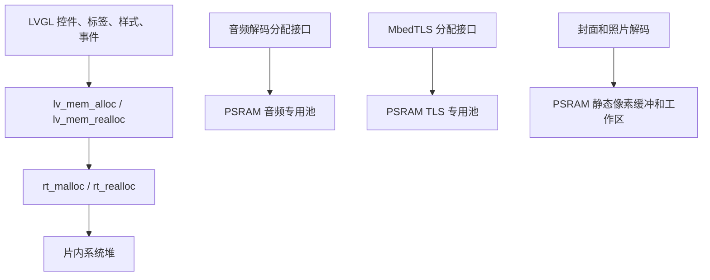

# HSP Watch 内存分析、MAP 排查与优化操作

本文记录本项目“点击蜂窝菜单中的蓝牙后卡死”的排查过程，并提供后续可复用的操作步骤。
适用于 SiFli SDK v2.5、SF32LB52、RT-Thread、LVGL v8 和 ARM GCC 工具链。

文档整理日期：2026-09-18。静态数据取自 2026-09-17 构建的主固件；崩溃数据取自
项目根目录的 `logtest.txt`。每次重新编译后，地址和占用都应重新读取。

阅读导航：

- [本次结论](#1-这次问题的结论)
- [工具、文件和现场归档](#2-准备工具和构建产物)
- [运行时日志判读](#3-先读运行时日志)
- [LVGL 分配器归属](#4-确认-lvgl-到底使用哪块内存)
- [MAP 与静态占用](#5-分析-map-和静态占用)
- [PC/LR 地址定位](#6-用-elf-还原崩溃地址)
- [具体优化方法](#7-本次具体优化方法)
- [优化效果验证](#8-如何验证优化是否有效)
- [常见误判](#9-常见误判速查)

## 1. 这次问题的结论

日志中三次崩溃时，RT-Thread 系统堆分别只剩 **20、80、24 字节**。
两次出现 `lv_obj_allocate_spec_attr` 分配失败断言，另一次在创建 LVGL 对象时发生
非法内存访问。蓝牙页需要创建较多控件，同时其他应用页面长期保留，最终使系统堆耗尽。

因此，本次修改集中在精简控件、按需创建页面、退出后释放页面，以及同步清理页面任务。
现有的音频和 TLS 专用 PSRAM 池没有自动为 LVGL 提供分配空间。

建议按以下顺序排查：

1. 保存故障固件对应的 BIN、ELF、MAP、配置和完整串口日志。
2. 从日志区分系统堆耗尽、线程栈不足、非法访问或等待阻塞。
3. 用匹配的 ELF 将 PC/LR 定位到函数和源码，确认实际失败操作。
4. 用 MAP 和 `nm` 分析静态内存归属，再用运行时日志测量页面开关的增量。
5. 修改资源生命周期和分配策略，重新编译并验证重复进出及后台业务。

## 2. 准备工具和构建产物

### 2.1 文件位置

主工程是 `project/`，本开发板构建产物通常位于：

```text
project/build_sf32lb52-lchspi-ulp_hcpu/
    main.bin
    main.elf
    main.map
    main.asm
    rtconfig.h
    compile_commands.json
```

| 文件 | 用途 |
| --- | --- |
| `main.bin` | 实际烧录或 OTA 的主固件镜像，文件大小不是运行内存占用 |
| `main.elf` | 包含段、符号和调试信息，用于地址定位及符号大小统计 |
| `main.map` | 链接器的内存布局、输入段、目标文件和符号归属 |
| `main.asm` | 构建生成的反汇编，辅助核对故障指令 |
| `rtconfig.h`、`compile_commands.json` | 核对生成配置、宏、头文件路径和实际编译参数 |

Loader、bootloader、LCPU 各有自己的产物。主固件崩溃时不要误用 `dfu/`、`bootloader/`
或 `lcpu/` 下的 ELF/MAP；OTA 进入 Loader 后发生的问题则应分析对应 Loader。

### 2.2 PowerShell 环境

以下 PowerShell 命令在项目根目录执行，路径按实际环境修改。VSCode 中打开“终端”即可。

```powershell
Set-Location 'D:\iotproject\lcHspEc800m\lcHsp\watch_pro\lchspi-development-learning'
$projectRoot = (Get-Location).Path
$buildDir = Join-Path $projectRoot 'project\build_sf32lb52-lchspi-ulp_hcpu'
$armTools = Join-Path $env:USERPROFILE '.sifli\tools\arm-none-eabi-gcc\14.2.1\bin'
$elfFile = Join-Path $buildDir 'main.elf'
$mapFile = Join-Path $buildDir 'main.map'
Get-Item $elfFile, $mapFile, (Join-Path $buildDir 'main.bin')
```

若工具链版本不同，只需调整 `$armTools`。PowerShell 调用带路径的程序时使用 `&`：

```powershell
& "$armTools\arm-none-eabi-size.exe" --version
```

### 2.3 修改前归档

先确认当前产物就是故障手表烧录的那一份，再归档。重新编译会覆盖原 ELF/MAP，
即使版本号没有变化，函数地址也可能改变。只有版本号相同不足以证明两份固件相同。

```powershell
$archiveDir = Join-Path $env:USERPROFILE ('watch-debug\' + (Get-Date -Format 'yyyyMMdd-HHmmss'))
New-Item -ItemType Directory -Path $archiveDir | Out-Null
foreach ($name in @('main.bin', 'main.elf', 'main.map', 'main.asm', 'rtconfig.h', 'compile_commands.json')) {
    Copy-Item (Join-Path $buildDir $name) $archiveDir
}
Copy-Item .\logtest.txt, .\project\proj.conf, .\project\rtconfig_project.h $archiveDir
git rev-parse HEAD | Set-Content (Join-Path $archiveDir 'commit.txt')
git status --short | Set-Content (Join-Path $archiveDir 'worktree-status.txt')
git diff --binary --output="$archiveDir\worktree.patch"
Get-FileHash (Join-Path $archiveDir 'main.bin') -Algorithm SHA256 |
    Format-List | Out-File (Join-Path $archiveDir 'main.sha256.txt')
```

补充记录复现操作、手机连接、TF 插拔、音频播放和 OTA 状态。`git diff` 不包含未跟踪文件，
新增源码和本地 SDK 修改也需另行保留；不要仅靠提交号恢复一个尚未提交的故障现场。

## 3. 先读运行时日志

### 3.1 计算剩余系统堆

本次日志中的第一组数据是：

```text
Assertion failed at function:lv_obj_allocate_spec_attr, line number:347 ,(0)
total memory: 247488 used memory : 247468 maximum allocated memory: 247468
```

计算公式为 `free = total - used`，三组数据如下：

| 日志位置 | 系统堆总量 | 已使用 | 剩余 |
| --- | ---: | ---: | ---: |
| `logtest.txt:138` | 247488 B | 247468 B | 20 B |
| `logtest.txt:651` | 247488 B | 247408 B | 80 B |
| `logtest.txt:1137` | 247488 B | 247464 B | 24 B |

几十字节已经不足以完成正常的控件创建。一次 `lv_obj_create()` 还可能分配对象属性、
父对象的子对象指针数组、样式和事件描述，并非只分配一个 `lv_obj_t`。

同一日志还显示：

```text
          pool size  max used size available size
audpsram  131072     72            131000
tlspsram  98304      72            98232
```

这些是独立 `rt_memheap` 的数据，不能相加后作为 `rt_malloc()` 的可用空间。
`disk free: 3.4 MB` 是文件系统剩余容量，也与控件分配无关。

### 3.2 区分其他原因

| 证据 | 后续检查 |
| --- | --- |
| 分配失败，系统堆接近 0 | 检查创建峰值、常驻页面、未释放的资源 |
| 系统堆还有余量，但较大分配失败 | 核对分配器、请求大小、连续空闲块和内存碎片 |
| 每次退出后剩余堆持续下降 | 检查页面、定时器、异步回调及业务缓冲的生命周期 |
| PC 附近出现空指针访问 | 结合前面的分配失败和反汇编，确认是否未检查返回值 |
| 线程栈接近耗尽或栈检查报错 | 检查局部大数组、递归、嵌套调用及对应线程栈 |
| 无崩溃日志但界面不再刷新 | 检查主线程状态、锁等待和同步文件/网络操作耗时 |

本次 `main` 线程栈为 `0x1800 = 6144 B`，日志中的最大使用率约为 43%～45%，
没有显示栈已耗尽。这个证据支持先解决系统堆问题，但不能用于排除所有越界写。

### 3.3 串口侧采样

在手表串口的 `msh />` 提示符下执行，以下不是 Windows 终端命令：

```text
list_mem
list_memheap
list_thread
```

`list_mem` 查看系统堆，`list_memheap` 查看独立内存堆，`list_thread` 查看线程及栈。
用 `help` 确认当前固件导出的命令；若配置裁剪了 FinSH，就使用已有的 `ui_mem:` 日志。

需要进一步查碎片或堆破坏时，可检查 SDK 的 `RT_USING_MEMTRACE` 配置及 `memtrace`、
`memcheck` 命令。跟踪本身会增加开销，应在调试构建中使用并重新建立采样基线。

## 4. 确认 LVGL 到底使用哪块内存

本项目实际适配位于 SDK 的 `middleware/lvgl/lv_conf_sifli.h`，启用 `RT_USING_HEAP` 时：

```c
#define LV_MEM_CUSTOM 1
#define LV_MEM_CUSTOM_ALLOC   rt_malloc
#define LV_MEM_CUSTOM_FREE    rt_free
#define LV_MEM_CUSTOM_REALLOC rt_realloc
```

所以 `lv_mem_alloc()` 最终使用系统堆。生成配置里的 `LV_MEM_SIZE_KILOBYTES 32`
不能直接解释为当前 LVGL 只有 32 KB，也不能通过单独调大它扩容此分配路径。



音频池分配失败时，当前 `audio_mem_malloc()` 可以回退系统堆；TLS 池正常启用后，
池内分配失败会返回错误，不继续挤占系统堆。分析并发播放/联网时应考虑这种差异。

SDK 的 LVGL v8 `lv_mem_monitor()` 在 `LV_MEM_CUSTOM == 1` 时没有统计 RT-Thread 堆，
其零值不能作为堆使用率或碎片率。这里应使用 `rt_memory_info()` 和 RT-Thread 的诊断。

## 5. 分析 MAP 和静态占用

### 5.1 先看 Memory Configuration

```powershell
Select-String -Path $mapFile -Pattern '^Memory Configuration' -Context 0,10
```

本次 MAP 的主要区域：

| 区域 | 起始地址 | 长度 | 解释 |
| --- | --- | --- | --- |
| ROM | `0x12218000` | `0x00788000` | 主固件链接使用的 Flash 区间 |
| RAM | `0x20000000` | `0x0007fc00` | 523264 B 片内 RAM 区间 |
| PSRAM | `0x60000000` | `0x00800000` | 8 MiB 外部 RAM 区间 |

这是链接器允许放置内容的范围，不是当前动态可用量。MAP 中 ROM2/ROM3 等区域可能
与其他 Flash 定义重叠，不能把所有区域长度直接相加。

### 5.2 看段、运行地址和加载地址

```powershell
Select-String -Path $mapFile -Pattern '^\.(text|rodata|data|bss|heap|stack|RW_PSRAM)' -Context 0,4
```

| 常见段 | 主要内容 | 判断方式 |
| --- | --- | --- |
| `.text`、`.rodata` | 代码、常量、字体和图片资源 | 结合地址判断是否位于 Flash |
| `.data` | 带初值的全局/静态变量 | 运行时占 RAM，初值通常也占 Flash |
| `.bss` | 零初始化的全局/静态变量 | 占 RAM，通常不为每个零字节存储镜像数据 |
| `.stack`、`.heap` | 链接脚本预留空间 | 不代表所有线程栈或 RT-Thread 系统堆 |
| `.RW_PSRAM_NON_RET` | 本项目外部 RAM 中的缓冲和专用池 | 已经占用 PSRAM，不能重复计算为系统 SRAM |

例如当前 `.data` 的运行地址是 `0x20015300`，大小 `0x2718`，同时有 Flash
`load address`。统计时区分运行地址 VMA 与加载地址 LMA。SDK 还有特殊段，
字体位图甚至可能在 `nm` 中显示为 `t`，所以不能只凭符号字母判断它是函数还是数据。

MAP 前面的 `Discarded input sections` 是未参与最终镜像的输入段，后面的
`Cross Reference Table` 是引用关系。统计容量应看 `Linker script and memory map`
中的实际输出段，避免把丢弃段或同一符号的多处引用算进去。

### 5.3 找最大的静态符号

```powershell
& "$armTools\arm-none-eabi-size.exe" -A $elfFile
& "$armTools\arm-none-eabi-nm.exe" -S --size-sort --radix=d --defined-only $elfFile |
    Select-Object -Last 25
```

`nm` 此处各列为十进制地址、十进制大小、类型、名称，按大小升序输出。
大型字体和 GIF 可能占据最后几项，但其 Flash 体积不等于系统堆压力。
进一步按当前 MAP 的地址范围分别查看 RAM 和 PSRAM：

```powershell
$symbols = & "$armTools\arm-none-eabi-nm.exe" -S --size-sort --radix=d --defined-only $elfFile |
    ForEach-Object {
        if ($_ -match '^\s*(\d+)\s+(\d+)\s+([A-Za-z])\s+(.+)$') {
            [pscustomobject]@{
                Address = [uint64]$Matches[1]
                Bytes = [uint64]$Matches[2]
                Type = $Matches[3]
                Name = $Matches[4]
            }
        }
    }
$symbols | Where-Object { $_.Address -ge 0x20000000 -and $_.Address -lt 0x2007fc00 } |
    Sort-Object Bytes -Descending | Select-Object -First 20 |
    Format-Table @{Name='Address'; Expression={'0x{0:X8}' -f $_.Address}}, Bytes, Type, Name
$symbols | Where-Object { $_.Address -ge 0x60000000 -and $_.Address -lt 0x60800000 } |
    Sort-Object Bytes -Descending | Select-Object -First 20 |
    Format-Table @{Name='Address'; Expression={'0x{0:X8}' -f $_.Address}}, Bytes, Type, Name
```

本次 ELF 中部分静态占用如下，不是运行时动态分配排行：

| 符号 | 大小 | 所在区域 | 所属功能 |
| --- | ---: | --- | --- |
| `buf1_1` | 39000 B | RAM | SDK 显示缓冲 |
| `memp_memory_PBUF_POOL_base` | 25219 B | RAM | lwIP 网络缓冲 |
| `sd_music_ctx` | 21012 B | RAM | TF 音乐上下文 |
| `tf_fm_entries` | 18560 B | RAM | TF 文件列表条目数组 |
| `audio_server_stack` | 9216 B | RAM | 音频服务线程栈 |
| `buf2_1` | 351000 B | PSRAM | SDK 显示缓冲 |
| `audio_psram_pool` | 131072 B | PSRAM | 128 KiB 音频池 |
| `hsp_tls_psram_pool` | 98304 B | PSRAM | 96 KiB TLS 池 |
| `camera_preview_pixels` | 51200 B | PSRAM | 160 x 160 x 2 的 RGB565 缓冲 |
| `music_cover_pixels` | 32768 B | PSRAM | 128 x 128 x 2 的 RGB565 缓冲 |

符号大小不包含全部对齐、段填充和匿名内容，也可能包含地址别名，不能直接求和替代段统计。
MAP 可以定位静态数组所属模块，但无法列出堆中每个活动 `lv_obj_t`。

### 5.4 从段追到源文件

```powershell
Select-String -Path $mapFile -Pattern 'tf_fm_entries|sd_music_ctx|l2_non_ret_bss_(audio_pool|camera_preview|music_cover|hsp_tls_pool)' -Context 1,3
```

例如：

```text
.bss.l2_non_ret_bss_audio_pool
                0x6006db40    0x20000 ...\src\services\audio_memory_pool.o
```

含义是这个输入段占用 `0x20000 = 131072 B`，放在 PSRAM，由
`src/services/audio_memory_pool.c` 产生。返回源码检查数组声明、段宏和分配接口。
比较优化前后时，同时比较区域、段大小、符号大小和运行时采样，不能只比较 `main.bin`。

### 5.5 不要把 .heap 当作系统堆容量

当前 MAP 的 `.heap` 只有 `0xc00 = 3072 B`，但崩溃日志报告的系统堆总量为 247488 B。
本板 GCC 配置的 `HEAP_BEGIN` 来自 `__bss_end`，`HEAP_END` 来自板级 RAM 边界，
SDK `drv_common.c` 使用它们调用 `rt_system_heap_init()`。

对应 SDK 文件：

- `customer/boards/sf32lb52-lchspi-ulp_base/bsp_board.h`
- `rtos/rtthread/bsp/sifli/drivers/drv_common.c`
- `rtos/rtthread/src/mem.c`

因此，静态 SRAM 增长可能压缩系统堆空间。最终可用值还受对齐和分配器管理开销影响，
以同版本启动后的 `rt_memory_info()` 为准。动态创建的线程栈也可能来自系统堆，
不能只查看链接器 `.stack` 段。

## 6. 用 ELF 还原崩溃地址

本次日志另一次故障包含：

```text
lr: 0x122ba1f3
pc: 0x1223a4fe
SCB_CFSR_MFSR:0x82 DACCVIOL SCB->MMAR:00000070
```

下面的 `$faultElf` 必须指向该次故障时归档的 ELF，不能直接使用已修复重编的文件：

```powershell
$faultElf = 'D:\watch-debug\bt-crash\main.elf'
& "$armTools\arm-none-eabi-addr2line.exe" -a -f -C -i -e $faultElf 0x1223a4fe 0x122ba1f2
& "$armTools\arm-none-eabi-objdump.exe" -d -S -l -C --disassemble=lv_obj_class_create_obj $faultElf |
    Out-File .\fault-lv-obj-class.txt
```

PC 用于定位当前指令；Cortex-M 的 LR/函数指针可能带 Thumb 状态位，必要时先清除最低位，
所以示例将 `0x122ba1f3` 处理为 `0x122ba1f2`。LR 是返回地址，查调用点还应观察附近
反汇编，不能固定减 4 后就认定为调用指令。异常返回值如 `0xFFFFFFFD` 不是普通代码地址。

排查时使用对应 ELF，将 PC 定位到 `lv_obj_class_create_obj` 的父对象子指针数组扩容路径：
系统堆分配失败后，未检查扩容结果便继续访问数组。应结合源码、寄存器和剩余堆一起判断，
不能仅凭一个 `DACCVIOL` 就归因于蓝牙协议栈。

若 `addr2line` 输出 `??:0`，检查 ELF 是否匹配、是否保留调试信息，以及地址是否位于 ROM
库代码、内联代码或已被破坏。MAP 可帮助定位附近符号，但仅有 MAP 通常无法恢复源码行号。

## 7. 本次具体优化方法

### 7.1 精简蓝牙页面

修改 [ui_BluetoothSettings.c](../../src/ui/generated/screens/ui_BluetoothSettings.c)：

- 删除无实际实现的配对管理、通话、诊断以及页面内 PAN 偏好等控件。
- 保留蓝牙开关、手机连接、网络共享真实状态、查找/停止查找手机，改为中文显示。
- 减少容器嵌套、重复装饰和事件对象，直接复用现有中文字体。
- 每秒检查一次状态，通过状态位比较跳过无变化的刷新。
- 字面量使用 `lv_label_set_text_static()`，减少标签文字反复分配。

`lv_label_set_text_static()` 要求字符串在标签使用期间始终有效。只能用于字符串常量
或生命周期足够长的缓冲，不能传入函数栈上的临时 `char text[64]`。

### 7.2 普通页面按需创建

[ui.c](../../src/ui/generated/ui.c) 不再开机创建 RGB、木鱼、TF 文件管理和录音页面。
入口发现页面指针为空时再调用各自 `screen_init()`。

“初始化后台服务”和“创建页面”分开：例如 `ui_Record_init()` 只初始化录音服务；
日历和录音的页面刷新定时器随页面创建，退出后删除。

### 7.3 使用统一退出释放入口

公共实现是 [ui_screen_lifecycle.c](../../src/ui/generated/ui_screen_lifecycle.c)。
新增普通页面时，在根对象创建后注册现有销毁函数，例如：

```c
#include "ui/generated/ui_screen_lifecycle.h"

/* Inside ui_Calendar_screen_init(), after the NULL guard. */
ui_Calendar = lv_obj_create(NULL);
ui_screen_release_on_unload(ui_Calendar, ui_Calendar_screen_destroy);
```

注册的是 `LV_EVENT_SCREEN_UNLOADED`，即旧页卸载后再释放。本 SDK 在动画结束时先发送
新页 `SCREEN_LOADED`，再给旧页发送 `SCREEN_UNLOADED`，不应在新页加载事件里提前
删除旧页，也不应在点击返回时立即删除仍参与动画绘制的页面。

此机制使用各页销毁函数，页面切换继续传 `auto_del=false`，避免同时交给两套机制销毁。
公共回调还处理了三个边界：

- 忽略子对象冒泡的事件。
- 重复注册时先移除旧回调，避免连续返回造成重复释放。
- 如果事件目标仍是当前屏幕则不删除，允许闹钟/提醒页面重新加载自身。

不要把主页中的 tile 或仍被导航系统持有的子页面直接套用普通 screen 的销毁规则。

### 7.4 销毁控件时同时处理关联资源

仅调用 `lv_obj_del()` 不能删除独立创建的所有任务。各页销毁时依次核对：

1. 删除页面专属的 `lv_timer_t`，并将指针置空。
2. 取消尚未执行的 `lv_async_call()`，清除对应 queued 标志。
3. 停止或删除引用页面对象的动画、GIF 解码器等资源。
4. 删除页面树，清空页面及子控件引用，处理图片缓存/预览引用。
5. 再次打开时从业务服务状态重建页面。

本次日历、番茄钟、闹钟和喝水页补齐了相关刷新清理。木鱼动画将目标图像绑定到
`lv_anim_set_var()`，使对象删除时可以取消其动画，并移除原来额外分配的动画上下文。
蓝牙、设置、指南针、运动、TF 浏览器等页面的销毁函数负责删除各自定时器。

`lv_async_call_cancel(callback, user_data)` 按回调和参数匹配，取消时应与创建时一致。
UI 删除、定时器及异步队列操作仍应遵循现有 LVGL 线程/锁规则，不能从任意后台线程
直接操作控件。关闭页面也不代表正在执行的业务线程已经退出。

### 7.5 明确需要保留的内容

| 内容 | 当前规则 |
| --- | --- |
| 蓝牙、设置、计算器、日历、运动、指南针、相机、TF 浏览等普通独立页面 | 退出后销毁，下次按需创建 |
| RGB、闹钟、喝水、番茄钟的页面 | 退出后释放 UI，保留灯效、计时和提醒服务 |
| 表盘、蜂窝菜单、音乐、控制中心和通知等导航页面 | 保留主页导航所需对象 |
| 音乐播放服务 | 页面切换不终止后台播放 |
| 录音页被通知/提醒临时切走 | 保留页面和进行中的录音 |
| 用户主动返回退出录音页 | 停止录音/回放，按服务流程收尾，卸载后释放页面 |

静态数组不受 `lv_obj_del()` 管理。比如 `tf_fm_entries`、`record_entries` 及 PSRAM
像素缓冲仍然存在；“退出释放”指页面和其动态资源，并不表示整个模块的静态 RAM 清零回收。

### 7.6 大缓冲与内存池

本项目已有的分配策略也应在分析时保留：

- 音频解码使用 [audio_memory_pool.c](../../src/services/audio_memory_pool.c) 的 128 KiB PSRAM 池。
- HTTPS 使用 [hsp_tls_memory.c](../../project/ota_client/hsp_tls_memory.c) 的 96 KiB PSRAM 池。
- 音乐封面用 4096 B 工作区解码到 128 x 128 RGB565 静态缓冲，再由 LVGL 缩放显示为 184 x 184。
- 相机照片最长边限制为 160 px，使用 4096 B 工作区和 160 x 160 RGB565 静态缓冲。

这些像素和工作区位于 PSRAM。静态工作区用固定占用换取可预测的解码峰值，关闭页面不会
释放它们；共享工作区还必须保证不会并发解码。

后续若需要继续减少 SRAM，可评估文件列表容量、音乐上下文、网络缓冲或显示缓冲。
先测量业务上限，再决定分页、缩减或迁移。DMA/显示缓冲迁移还涉及地址可达性、对齐、
缓存一致性和休眠保持要求，不能仅给数组加一个 PSRAM 段宏就认为完成。

本次没有整体替换 LVGL 的分配器。若另行迁移，`alloc/realloc/free` 必须配套，不能
混用不同池的释放接口，还需独立验证性能和电源状态恢复。

## 8. 如何验证优化是否有效

### 8.1 用 ui_mem 测量页面开关

现有 `ui_screen_log_memory()` 调用 `rt_memory_info()`，输出：

```text
ui_mem: bluetooth before free=... used=... peak=...
ui_mem: bluetooth ready free=... used=... peak=...
ui_mem: screen released free=... used=... peak=...
```

`ready.used - before.used` 可近似观察页面创建增量，但并发蓝牙/文件操作也会影响差值。
`peak` 是本次启动以来的最高占用，退出后不会下降。切换动画期间两页短暂共存是正常现象。

先预热主页和测试入口，保持手机连接、TF 卡和后台任务条件一致，在动画结束且后台稳定后
用 `list_mem` 再采样。记录以下表格，不要仅凭一次退出后的读数认定泄漏：

| 轮次/应用 | 进入前 free | 页面显示后 free | 退出并稳定后 free | 后台业务状态 |
| --- | --- | --- | --- | --- |
| 预热后基线 | 待测 | 待测 | 待测 | 待记录 |
| 蓝牙第 1 次 | 待测 | 待测 | 待测 | 待记录 |
| 蓝牙第 10 次 | 待测 | 待测 | 待测 | 待记录 |
| 多应用交替后 | 待测 | 待测 | 待测 | 待记录 |

正常预期是退出后的 `free` 回到相近水平，而不是每轮持续下降。总空闲量稳定也不能
完全排除碎片、短时峰值和生命周期错误，需要结合分配请求及功能回归。

### 8.2 真机操作顺序

1. 用 VSCode SiFli 插件编译主工程，确认成功后烧录本次固件，重启并记录启动日志。
2. 从蜂窝菜单和控制中心分别进入蓝牙页，验证开关、中文连接状态、查找手机和返回位置。
3. 反复进入/退出蓝牙，再交替打开日历、计算器、RGB、木鱼、相机和 TF 浏览器。
4. 测试快速返回、切换动画、木鱼按下动画中返回，以及闹钟/提醒在自身页面内弹出。
5. 播放 TF 音乐后切换普通应用，确认播放仍正常且不逐轮消耗系统堆。
6. 验证录音被通知打断后仍能继续，主动退出后 WAV 正常保存且可以回放。
7. 退出提醒/番茄钟页面后等待后台事件触发，确认服务未因 UI 释放而停止。
8. 在受支持的使用条件下检查 OTA 查询、TF 插拔、照片传输等操作的峰值及错误日志。

如果仍卡死，提供完整串口日志、最短复现顺序、各阶段 `ui_mem`、匹配的 ELF/MAP 和固件
SHA256。此时继续区分未覆盖的内存峰值、碎片、资源泄漏及主线程阻塞。

### 8.3 主机页面回归

[tests/ui_lifecycle](../../tests/ui_lifecycle/) 使用 SDK 自带的真实 LVGL 和生产蓝牙页面代码，
模拟蓝牙接口及返回入口，在 390 x 450 无硬件显示环境下检查页面行为。Linux/WSL 执行：

```sh
cmake -S tests/ui_lifecycle -B /tmp/hsp-ui-lifecycle -G Ninja \
  -DSIFLI_SDK=/mnt/d/iotproject/LCHSP/OpenSiFli/githubsdk/SiFli-SDK/v2.5/SiFli-SDK-V2.5 \
  -DCMAKE_BUILD_TYPE=Debug
cmake --build /tmp/hsp-ui-lifecycle -j8
ctest --test-dir /tmp/hsp-ui-lifecycle -V
```

需要 GCC、CMake 和 Ninja，SDK 路径按本机调整。测试启用 AddressSanitizer 和
UndefinedBehaviorSanitizer，覆盖 101 次页面创建/释放、重复返回、同页重载、开关、
连接状态、查找手机、未变化状态刷新和控件边界。渲染结果为测试构建目录中的 `bluetooth.ppm`。

2026-09-17 的测试记录：

```text
PASS: 101 open/close cycles, stable heap=5196, page cost=3764, timers=2;
both return paths exercised (102/100).
100% tests passed, 0 tests failed out of 1
```

这是主机测试分配器统计的数据，不是手表实测剩余 SRAM，也不是优化前后的节省量。
101 轮包含预热，返回次数因重复返回测试而多于页面打开次数。测试未替代所有应用的
生命周期验证，更未覆盖实际无线连接、DMA、音频和休眠恢复。

若 LeakSanitizer 提示无法在 `ptrace` 下运行，应在不附加调试器/跟踪沙箱的普通终端
执行同一测试。关闭检测后的“通过”不能当作泄漏检查已经通过。

### 8.4 已完成与待确认

本次修复已完成主固件编译/链接、上述主机回归和中文界面渲染检查。
2026-09-17 产出的 `main.bin` 为 4494876 B；该数字用于识别构建快照，不用于判断堆余量。
真机多应用切换、后台音频与提醒稳定性仍需按本节步骤验证。

## 9. 常见误判速查

| 说法 | 应如何核对 |
| --- | --- |
| “有 8 MB PSRAM，所以 LVGL 不会缺内存” | 查 LVGL 分配宏和实际堆归属 |
| “MAP 显示 RAM 还有空间，运行时一定够用” | 动态控件、线程栈和服务缓冲会在启动后继续消耗堆 |
| “增大 LV_MEM_SIZE 就能修复” | 本项目使用自定义分配器，先核对生效配置 |
| “返回主页就是退出应用” | 检查旧页面及 timer/async/动画是否真正释放 |
| “删掉页面就释放了照片和文件列表全部内存” | 静态数组和独立业务池不会随页面删除 |
| “peak 没下降说明有泄漏” | 比较相同状态下的 used/free，peak 只记录历史最高值 |
| “删掉大字体就能解决系统堆耗尽” | 先看字体地址和运行方式，Flash 常量通常不直接占系统堆 |
| “关闭 LVGL 断言就不会卡死” | 分配失败仍存在，可能转成更难定位的非法访问 |
| “当前 ELF 能分析昨天任何一份日志” | 必须匹配实际故障固件，版本号相同也不够 |

返回 [项目 README](../../README.md)。
