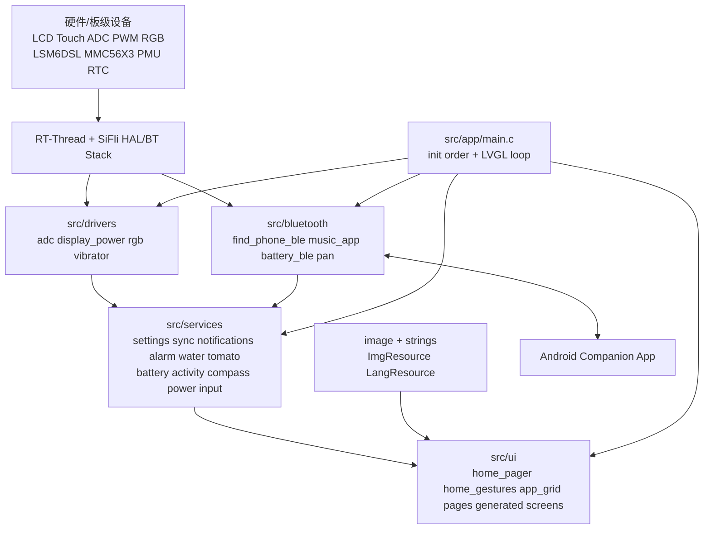
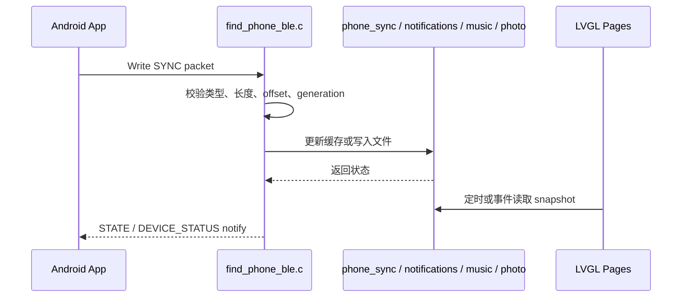
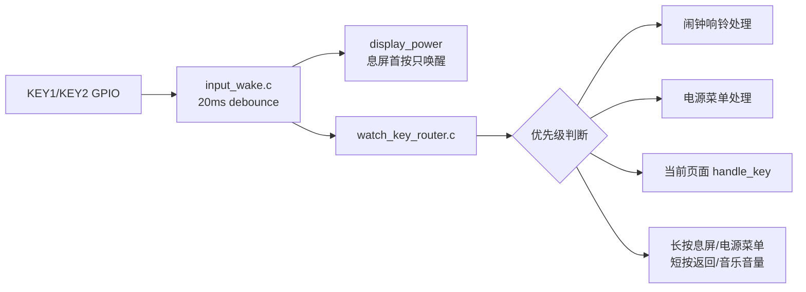
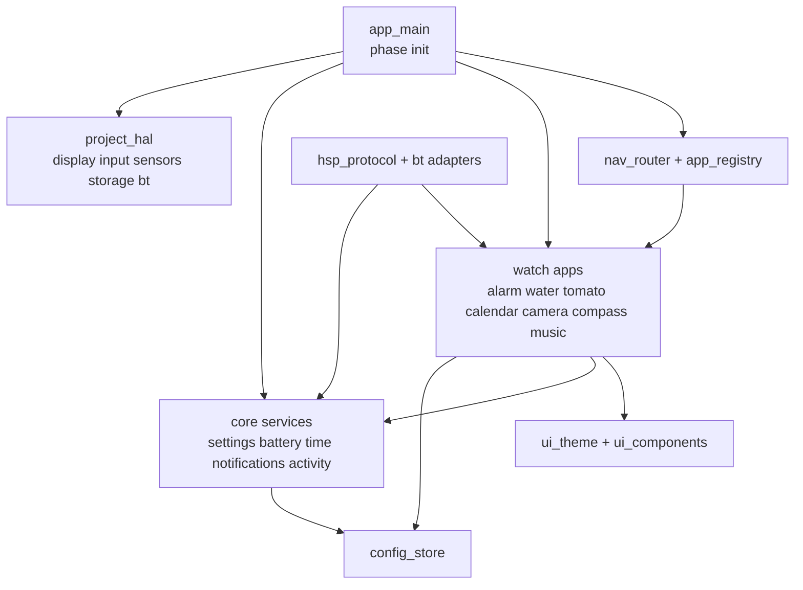

# HSP Watch 代码架构分析与优化方向

分析日期：2026-08-22  
分析对象：当前仓库手表固件侧代码，重点覆盖 `src/`、`project/`、`image/`、`simulator/` 与现有文档。  
当前固件版本：`0.3.0`

## 1. 总体结论

本项目是一个面向 SiFli SF32LB52 黄山派开发板的智能手表固件，整体采用 **SiFli SDK + RT-Thread + LVGL v8** 的嵌入式单体应用形态。代码已经形成了相对清晰的物理分层：`drivers/` 管硬件抽象，`services/` 管业务状态与后台任务，`bluetooth/` 管 BLE/经典蓝牙能力，`ui/` 管 LVGL 页面与交互，`image/` 和 `resource/strings/` 管资源构建。

当前架构的主要优势是功能落地速度快、模块按业务目录拆分明确、很多服务已经提供 snapshot/getter/event callback 形式的接口，适合小团队快速迭代手表功能。主要风险来自功能增长后的耦合：启动初始化集中在 `main.c`，导航与按键路由集中知道大量页面，部分服务直接操作 UI/硬件，SquareLine 生成目录中混入大量手写逻辑，持久化和样式代码重复较多。

建议后续优化不要做“大重构”，而是按风险优先级逐步引入 **应用注册表、统一导航、统一配置存储、BLE 协议头文件/文档、UI 组件样式库、服务事件总线或轻量消息分发**。这些改造可以在保持现有功能稳定的前提下，让新增页面、设置项和 BLE 同步命令更可控。

## 2. 技术栈与工程形态

### 2.1 核心技术

| 类型 | 当前使用 |
| --- | --- |
| 芯片/板级 | SiFli SF32LB52 黄山派开发板 |
| OS/框架 | RT-Thread |
| 图形 UI | LVGL v8.3.11，`littlevgl2rtt` 适配 |
| 构建系统 | SiFli SDK SCons 工程，入口在 `project/SConstruct` |
| 蓝牙 | SiFli BT/BLE stack，包含 BLE GATT、自定义服务、Battery Service、AVRCP/A2DP、PAN/HID |
| 文件系统 | RT-Thread DFS + ElmFat，挂载到 `/` |
| 资源 | SCons `Env.ImgResource`、`Env.Lang` 生成图片和语言资源 |
| 模拟器 | `simulator/` 下存在 VS/MSVC 模拟器工程 |

### 2.2 代码规模观察

当前 `src/` 下共有约 100 个 C/H 文件。`*.c` 总行数约 15 万行，其中 `src/ui/generated/hsp_font_cjk_22.c` 约 13.1 万行，是内嵌 CJK 字体数据；剔除该字体后，核心业务和 UI C 代码约 2 万行。

这说明项目真实维护压力不在总行数，而在业务功能数量与跨模块状态协调。后续优化应优先处理模块边界、导航生命周期、配置存储和协议演进，而不是单纯压缩文件数量。

## 3. 顶层目录职责

| 目录/文件 | 职责 |
| --- | --- |
| `src/app/` | 固件应用入口，完成启动门禁、文件系统挂载、服务初始化与 LVGL 主循环 |
| `src/drivers/` | 面向本项目的硬件驱动封装：ADC、电源显示、RGB、震动 |
| `src/services/` | 业务服务：RTC、设置、通知、同步、闹钟、喝水、番茄钟、电池、活动、指南针、电源、按键 |
| `src/bluetooth/` | 蓝牙协议、BLE 自定义 GATT、Battery Service、音乐控制、PAN/HID |
| `src/ui/` | LVGL 页面、主页手势、蜂窝菜单、设置页、业务应用页面 |
| `src/ui/generated/` | SquareLine 生成代码以及大量后续手工扩展代码 |
| `src/resource/strings/` | 语言资源 JSON，经 SCons 转为 LVGL 资源 |
| `image/` | 表盘、蜂窝菜单、番茄钟、示例照片、GIF 等图片资源 |
| `project/` | HCPU 固件 SCons 构建配置 |
| `simulator/` | Windows/MSVC LVGL 模拟器工程 |
| `lvgl/` | SDK/LVGL 示例、资源和参考工程 |
| `docs/` | 问题分析、设计说明和本架构报告 |

## 4. 当前运行架构



这个图体现了当前实际依赖方向，但代码中并非完全单向。例如：

- `battery_ui.c` 位于 `services/`，但同时负责采样、状态、BLE 发布、低电量 UI 提示和关机倒计时。
- `watch_key_router.c` 位于 `services/`，但直接包含大量 `ui/...` 页面头文件。
- `home_gestures.c` 位于 `ui/generated/`，但直接调用 BLE、设置、电源、通知等服务。
- `find_phone_ble.c` 既定义协议常量，又负责 GATT、重组、命令队列和业务分发。

这些不是当前功能的阻塞点，但已经是后续扩展的主要维护成本来源。

## 5. 启动流程分析

应用入口位于 `src/app/main.c`。启动逻辑可以概括为以下阶段：

1. 上电门禁与反馈：`power_manager_boot_gate()`、`power_manager_startup_feedback()`。
2. RTC 与时间初始化：`rtc_config()`、`set_date_time()`。
3. 手机同步和通知缓存初始化：`phone_sync_init()`、`phone_notifications_init()`。
4. RGB 初始化并默认关灯：`rgb_led_config()`、`rgb_led_set_color(0x000000)`。
5. LVGL 适配层初始化：`littlevgl2rtt_init("lcd")`。
6. LVGL 资源池和 UI 初始化：`lv_ex_data_pool_init()`、`ui_init()`。
7. 业务服务初始化：时间刷新、电池、显示电源、闹钟、喝水、番茄、输入唤醒、按键路由、抬腕、设置、指南针、蓝牙 PAN 等。
8. 主循环：持续调用 `lv_timer_handler()`，并按返回值 `rt_thread_mdelay(ms)`。

### 5.1 启动顺序特点

当前启动是一个固定顺序的集中式初始化列表。它的优点是直观、调试方便；缺点是服务间隐含依赖需要靠人工维护。例如：

- `ui_init()` 发生在部分服务初始化之前，因此 `home_pager.c` 中有注释说明控制中心和通知页依赖后续服务，需要延迟 prepare。
- `watch_settings_init()` 在 `display_power_init()`、`wrist_wake_init()`、`music_app_init()` 之后调用，因为它会把亮度、息屏、音量、震动、勿扰等设置实际应用到各子系统。
- `bt_pan_app_init()` 会在蓝牙栈 ready 后驱动 `battery_ble_stack_ready()` 和 `find_phone_ble_stack_ready()`。

建议后续将初始化拆成“基础硬件、基础服务、UI、后台服务、蓝牙能力”几个阶段，并用清晰的注释或注册表表达依赖关系。

## 6. 构建与资源架构

### 6.1 SCons 是实际主构建入口

`project/SConstruct` 负责准备 SiFli SDK 环境、加入 bootloader、LCPU 镜像、HCPU 应用、DFU 和 flash table。`project/SConscript` 会纳入 SDK、LCPU patch、`src/SConscript` 和 `image/SConscript`。

`src/SConscript` 采用目录列表 + `Glob('*.c')` 的方式纳入源码，当前覆盖新增页面和服务较完整：

- `app`
- `drivers`
- `services`
- `bluetooth`
- `ui/details`
- `ui/calculator`
- `ui/calendar`
- `ui/camera`
- `ui/compass`
- `ui/water`
- `ui/tomato`
- `ui/music`
- `ui/alarm`
- `ui/app_grid`
- `ui/safe`
- `ui/settings`
- `ui/system`
- `ui/generated`
- `ui/generated/components`
- `ui/generated/screens`

### 6.2 辅助构建清单存在滞后风险

`src/CMakeLists.txt` 和 `src/filelist.txt` 没有覆盖所有当前新增模块，例如部分闹钟、日历、喝水、番茄、相机、指南针等新增文件在 SCons 中已被 `Glob` 纳入，但辅助清单并不完整。若这些文件用于 IDE、静态分析、模拟器或其它工具链，会出现“主固件能编，辅助工具看不到文件”的问题。

建议明确：

- SCons 是唯一权威构建入口。
- 若 CMake/filelist 仍有用途，应增加同步脚本或改为由同一个模块清单生成。
- 若无用途，应在文档中标注废弃，避免误导维护者。

### 6.3 资源构建

`image/SConscript` 将图片资源转为 LVGL 可用的 C 资源，按屏幕色深选择 `rgb565` 或 `rgb888`。它纳入了：

- 根目录 GIF。
- `image/app_grid/*.png` 蜂窝菜单图标。
- `image/number/*.png` 表盘数字和状态图标。
- `image/number/tomoto/tomato_*.png` 番茄钟倒计时数字。
- `image/ezip/*.c`。

`src/resource/strings/SConscript` 在启用 `LV_EXT_RES_NON_STANDALONE` 时处理语言 JSON，并生成语言资源。该机制适合后续扩展多语言，但当前 UI 中仍有大量硬编码中文/英文字符串，后续需要分阶段迁移。

## 7. 核心模块分析

### 7.1 `drivers/` 硬件封装层

当前驱动层偏“项目级薄封装”，不是通用 BSP：

- `adc.c/.h`：初始化 ADC 并读取电池电压。
- `display_power.c/.h`：管理 LCD 亮度、息屏、触摸唤醒保护和用户活动 revision。
- `rgb.c/.h`：控制 SK6812 RGB LED。
- `vibrator.c/.h`：基于 PWM 控制震动，支持定时自动关闭和全局启停。

亮点：

- `display_power.c` 对触摸 read callback 做包装，实现“息屏后的第一次触摸只唤醒，不透传点击”，交互细节处理得很到位。
- `vibrator.c` 提供 `vibrator_set_enabled()`，能被设置服务统一管控。

风险：

- 部分服务绕过 `drivers/` 直接使用 `rt_device_read`、`rt_i2c_mem_read/write`、HAL RTC 等，例如活动、抬腕、指南针、闹钟。这在嵌入式项目中常见，但会降低模拟器和单元测试替换能力。
- `display_power.c` 直接替换 LVGL indev driver 的 `read_cb`，属于有效但较脆的 hook，需要在 LVGL/SiFli 触摸适配升级时重点回归。

优化方向：

- 将“传感器访问”按领域拆成轻量 HAL wrapper，例如 `sensor_step_counter`、`sensor_motion`、`sensor_compass`。
- 对 `display_power_install_touch_wake_guard()` 加兼容性注释和失败日志。
- 梳理所有硬件设备名、引脚极性、采样周期到集中配置头或 Kconfig。

### 7.2 `services/` 业务服务层

服务层承担了项目主要业务状态：

- 时间：`rtc.c`、`time_sync.c`。
- 设置：`watch_settings.c`。
- 电源：`power_manager.c`、`display_power.c` 协同。
- 输入：`input_wake.c`、`watch_key_router.c`。
- 手机数据：`phone_sync.c`、`phone_notifications.c`。
- 周期任务：`alarm_service.c`、`water_reminder_service.c`、`tomato_service.c`。
- 传感器业务：`battery_ui.c`、`activity_tracker.c`、`wrist_wake.c`、`compass_service.c`。
- 图片传输：`camera_photo_service.c`。

亮点：

- 多个服务已经使用 snapshot 输出，减少 UI 直接窥探内部状态。
- `phone_sync.c`、`phone_notifications.c`、`music_app.c` 等状态服务使用 mutex 保护共享数据。
- 闹钟、喝水、番茄、设置采用 magic/version/checksum 持久化，具备基本数据兼容和损坏检测能力。
- 提醒类服务普遍提供 event callback，UI 可以被动刷新。

主要问题：

- 服务层职责有混杂。例如 `battery_ui.c` 名称上是 UI，实际包含电量采样、滤波、充电状态、低电关机策略、主页绑定和 BLE 发布。
- `watch_key_router.c` 是全局输入路由，但它直接依赖大量 UI 页面，新增页面时需要改该文件。
- `tomato_service.c` 直接依赖 `alarm_service` 和 `water_reminder_service`，说明服务间已经开始出现业务优先级耦合。
- 多个服务重复实现配置文件 checksum、临时文件写入、rename 替换、默认值校验。

优化方向：

- 将 `battery_ui.c` 拆为 `battery_service.c` 和 `battery_home_widget.c` 或至少重命名职责。
- 引入统一 `app_lifecycle`/`nav_router`，让页面自己注册返回行为和按键处理。
- 抽出 `config_store`，提供 `load/save(magic, version, payload, validator)`。
- 给提醒类服务定义统一优先级模型，例如 alarm > power dialog > camera countdown > water/tomato notification。

### 7.3 `bluetooth/` 蓝牙与手机协议层

蓝牙层主要由四部分组成：

- `pan.c`：蓝牙栈事件入口、PAN/HID、NTP 相关逻辑，并在 stack/profile ready 后初始化 Battery Service 和自定义 BLE 服务。
- `battery_ble.c`：标准 Battery Service 电量发布。
- `find_phone_ble.c`：HSP 自定义 BLE GATT 服务，包含 `CONTROL`、`STATE`、`SYNC`、`DEVICE_STATUS` 特征。
- `music_app.c`：A2DP/AVRCP 状态、媒体元数据、歌词、封面、音量和播放控制。

`find_phone_ble.c` 当前承担多重职责：

- 定义 128-bit UUID 与 GATT attribute table。
- 处理 advertising 和连接状态。
- 处理 phone -> watch 的 `SYNC` 命令分发。
- 处理 notification/lyric/cover/photo 的分包重组。
- 构建设备状态包并 notify。
- 队列化通知删除和清空命令。

亮点：

- 协议长度、payload 最大值、状态 flag 定义清晰。
- 通知、歌词、封面、照片均有 begin/data 分包模型。
- device status 包兼容固件版本、电池、充电、活动数据。
- MTU 最大 244 字节的约束在代码和 README 中一致。

风险：

- BLE 协议常量全部藏在 `.c` 文件中，Android 端需要人工保持一致。
- 自定义服务权限当前为 `NOAUTH` 思路，README 已提醒不能视为认证/加密通道。
- `pan.c` 里存在硬编码 URL 和 NTP 线程逻辑，和手表本体业务边界不够清楚。
- 音乐和 companion cover 都涉及文件写入和 generation，需要更多错误码和可观测状态，便于 App 端重试策略演进。

优化方向：

- 新增 `src/bluetooth/hsp_protocol.h`，统一定义命令、包格式、长度、状态 flag、版本号。
- 在 `docs/` 中维护 BLE 协议规范，Android App 与固件共同引用。
- 为 `SYNC` 分发建立 command handler 表，降低 `switch` 膨胀。
- 分离 `find_phone_ble_gatt.c`、`hsp_sync_parser.c`、`hsp_device_status.c`、`hsp_notify_queue.c`。
- 后续若处理隐私数据，增加配对校验、加密要求或应用层 challenge。

### 7.4 `ui/` 页面与交互层

UI 层包含三类代码：

1. SquareLine 原始生成页面：`ui/generated/screens/*`、`ui.c`、`ui_helpers.c`、`ui_events.c`。
2. 在生成目录中的手工扩展：`home_pager.c`、`home_gestures.c`、`ui_swipe_back.c`、部分 screen 文件。
3. 独立手写页面：`ui/alarm`、`ui/water`、`ui/tomato`、`ui/calendar`、`ui/camera`、`ui/compass` 等。

当前导航核心是 `home_pager.c`：

- 使用 LVGL `tileview` 组织主页、音乐、蜂窝菜单、控制中心、通知列表。
- 主页位于中心 tile。
- 左右上下手势进入不同功能页。
- 音乐页会根据从主页或蜂窝菜单进入而改变父对象，提升交互连贯性，但增加生命周期复杂度。

蜂窝菜单由 `app_grid_ui.c` 实现：

- 图标枚举和图片声明一一对应。
- 支持拖动、惯性预测、最近图标吸附、边缘缩放。
- 通过 `app_grid_set_app_open_handler()` 把应用打开动作交给 `ui.c`。

亮点：

- 主页手势模型贴近手表产品体验。
- 多数业务页面都有 `open_from_app_grid()`、`return()`、`destroy()` 形式，已经有生命周期意识。
- `ui_swipe_back.c` 抽出了手势返回注册点。

风险：

- `src/ui/generated/` 中混入大量手写业务逻辑，未来重新生成 SquareLine 代码时风险高。
- UI 样式函数在多个页面重复，固定尺寸 `390 x 450`、圆角 `45`、深色卡片、header/back button 等模式很多。
- 页面返回逻辑分散在页面自身、`watch_key_router.c`、`home_pager.c` 和 `home_gestures.c`。
- 大量字符串硬编码在 C 文件里，语言资源机制尚未充分使用。
- 有些页面初始化时创建全局对象，有些页面打开时才创建，生命周期策略不完全统一。

优化方向：

- 将手写扩展移出 `ui/generated/`，例如迁移到 `ui/home/`、`ui/common/`，生成目录只保留可覆盖文件。
- 建立 `ui_shell`/`nav_router`，统一页面打开、返回、销毁、按键处理和来源记录。
- 建立 `ui_theme.h/.c`，封装常用颜色、字体、panel、card、header、button、slider 样式。
- 对所有页面定义统一生命周期约定：`init`、`open`、`close`、`destroy`、`handle_key`。
- 分批把 UI 文案迁移到 `resource/strings`。

## 8. 关键数据流

### 8.1 手机同步数据流



当前 UI 多数通过 timer 周期读取 snapshot，而不是完全事件驱动。这在小屏嵌入式 UI 中简单可靠，但页面数量继续增加后会产生较多周期 timer，需要统一管理。

### 8.2 输入唤醒与按键数据流



这个设计已经考虑了“息屏后的首次输入只唤醒”，产品行为很好。后续主要优化点是降低 `watch_key_router.c` 对具体页面的直接依赖。

### 8.3 持久化数据流

```mermaid
flowchart TD
    Service[业务服务状态] --> Pack[打包 magic/version/payload/checksum]
    Pack --> Tmp[写入 /xxx_config.tmp]
    Tmp --> Flush[fflush + fclose]
    Flush --> Rename[remove old + rename tmp]
    Rename --> Bin[/xxx_config.bin]
    Bin --> Load[启动读取]
    Load --> Validate[magic/version/checksum/字段校验]
    Validate --> State[恢复状态或默认值]
```

当前策略具备基本原子替换思想。可继续增强：

- 统一错误日志和返回码。
- 增加保存节流，避免滑块或频繁操作导致多次 flash 写。
- 对统计类数据考虑写入频率和掉电恢复策略。

## 9. 当前架构优点

1. 目录按领域划分清楚，新增功能容易定位。
2. 主路径功能完整，覆盖表盘、菜单、设置、音乐、通知、天气、位置、闹钟、喝水、番茄、相机、指南针等。
3. BLE companion 协议已经有明确特征划分和分包机制。
4. 很多服务已经具备 snapshot API，便于 UI 周期刷新。
5. 电源/唤醒交互细节成熟，尤其是首次触摸/按键只唤醒。
6. 配置文件具备 magic/version/checksum，优于裸写结构体。
7. 构建资源处理自动化程度较高，图片和语言资源可由 SCons 生成。
8. README 对功能边界和当前限制写得比较清楚，有助于后续维护。

## 10. 主要问题与风险

### 10.1 初始化顺序隐式耦合

所有初始化集中在 `main.c`。当某个服务依赖另一个服务已初始化时，目前主要靠顺序和注释保证。随着功能继续增加，容易出现初始化过早、UI 访问未初始化服务、低概率启动问题。

建议：

- 按阶段拆分 init。
- 对关键服务增加 `is_initialized` 或容错默认值。
- 在 `docs/` 中维护启动依赖说明。

### 10.2 生成代码和手写代码边界不清

README 已明确 `src/ui/generated/` 中包含大量手工扩展，不能直接整体重新生成或覆盖。这是当前最大的工程流程风险之一。

建议：

- 将可迁移的手写文件移到 `src/ui/home/`、`src/ui/common/`。
- 对必须留在 generated 的文件加顶部醒目标记。
- 建立 SquareLine 再生成操作说明和人工合并清单。

### 10.3 导航与页面生命周期分散

当前页面打开和返回逻辑分布在 `ui.c`、`home_pager.c`、`watch_key_router.c`、各页面 `return()` 中。新增页面通常要改多个位置。

建议：

- 建立应用注册表：

```c
typedef struct
{
    app_grid_app_id_t id;
    const char *name;
    void (*open)(ui_open_source_t source);
    void (*close)(void);
    uint8_t (*handle_key)(input_wake_key_t key, input_wake_event_t event);
} watch_app_t;
```

- `app_grid` 只负责选择 app id。
- `nav_router` 负责打开、返回、来源和按键分发。

### 10.4 服务层和 UI/硬件边界交叉

部分服务直接控制硬件或 UI 提示，页面也会直接操作多个服务。这种写法对单体固件很高效，但会让测试和复用变难。

建议：

- 低风险开始：先整理命名和职责文档。
- 中风险改造：拆 `battery_ui`，将 UI widget 与采样/策略分离。
- 长期改造：服务只发布状态/事件，UI 决定展示，硬件动作由策略层统一调度。

### 10.5 配置持久化重复

`watch_settings`、`alarm_service`、`water_reminder_service`、`tomato_service` 都有相似的文件格式和读写逻辑。

建议抽出：

- `config_store_load(path, magic, version, payload, size, validator)`
- `config_store_save_atomic(path, tmp_path, magic, version, payload, size)`
- 统一 FNV-1a checksum。
- 统一日志前缀和错误码。

### 10.6 BLE 协议缺少共享契约

固件端协议常量、命令码和包格式在 `find_phone_ble.c` 内部。Android 项目需要人工同步，后续容易产生版本漂移。

建议：

- 新增 `docs/hsp-ble-protocol.md`。
- 新增 `hsp_protocol.h`，集中定义命令码和格式。
- device status 增加 protocol version/feature bits 后，保持向后兼容。

### 10.7 UI 样式与布局重复

多个页面重复设置深色 panel、card、header、按钮、字体、圆角、边框、滚动区域和固定屏幕尺寸。

建议：

- `ui_theme.h/.c` 定义公共颜色、字体、屏幕尺寸、安全边距。
- `ui_components.h/.c` 提供 header、card row、toggle row、value row、back button、empty state。
- 页面只描述业务内容和事件。

### 10.8 辅助构建文件滞后

`src/CMakeLists.txt`、`src/filelist.txt` 已经明显落后于 SCons 模块目录。

建议：

- 若仍用于 IDE/模拟器，建立同步机制。
- 若不使用，标注废弃并避免新开发者误用。

### 10.9 可测试性不足

当前缺少明显的单元测试、协议解析测试和模拟器验证脚本。很多逻辑其实适合脱离硬件测试，例如：

- 农历/节日计算。
- 计算器表达式。
- 闹钟下一次触发计算。
- 番茄钟状态机。
- 喝水提醒时间窗。
- BLE packet parser。
- 配置文件 checksum/兼容加载。

建议先从纯逻辑模块开始补测试，再逐步把硬件依赖抽象出来。

## 11. 优化路线图

### P0：立即建议处理

| 方向 | 目标 | 预期收益 |
| --- | --- | --- |
| 明确 SCons 为权威构建 | 更新 README 或 docs，说明 CMake/filelist 状态 | 避免维护误判 |
| 生成目录保护 | 给 `src/ui/generated/` 中手写文件建立说明 | 避免 SquareLine 覆盖事故 |
| BLE 协议文档 | 将命令码、包格式、MTU、方向写入 docs | Android/固件协作更稳 |
| 配置保存节流 | 对亮度/音量等频繁设置保存做 debounce | 降低 flash 写压力 |
| 启动依赖说明 | 记录 `main.c` 初始化顺序依赖 | 降低新增服务踩坑概率 |

### P1：短期重构

| 方向 | 具体动作 | 影响范围 |
| --- | --- | --- |
| 抽 `config_store` | 合并 magic/version/checksum/temp rename 逻辑 | 设置、闹钟、喝水、番茄 |
| 抽 `ui_theme/ui_components` | 收敛 panel/card/header/back button 样式 | 所有手写页面 |
| 建立 `hsp_protocol.h` | BLE 命令码和包长度集中定义 | `find_phone_ble.c`、Android 协议文档 |
| 拆 `battery_ui` | 分离电池采样服务与主页/低电 UI 展示 | 电池、主页、设置、电源 |
| 页面生命周期统一 | 统一 `open/return/destroy/handle_key` 约定 | app_grid、key_router、各页面 |

### P2：中期架构升级

| 方向 | 具体动作 | 影响范围 |
| --- | --- | --- |
| 应用注册表 | app id、名称、图标、open、return、key handler 一处注册 | 蜂窝菜单、导航、按键 |
| 导航路由器 | 统一维护页面栈、来源、返回动画、屏幕对象生命周期 | UI 全局 |
| 服务事件总线 | 轻量 publish/subscribe 或 observer 列表 | 电池、通知、设置、音乐、提醒 |
| 协议 parser 表驱动 | 将 `SYNC` switch 拆为 handler 表 | BLE 同步层 |
| 模拟器回归 | 给核心页面建立打开/返回/刷新 smoke test | UI 可靠性 |

### P3：长期优化

| 方向 | 具体动作 | 价值 |
| --- | --- | --- |
| 功耗治理 | 统一管理 timer、传感器采样、蓝牙广播、屏幕亮度策略 | 提升续航 |
| 安全模型 | BLE pairing/encryption 或应用层认证 | 保护通知、位置、照片 |
| 资源体系 | 图片/font 分级加载，减少常驻内存压力 | 降低 RAM/flash 占用 |
| OTA/DFU 流程完善 | 结合版本、回滚、校验、用户提示 | 提升固件升级可靠性 |
| 自动化质量门禁 | 格式检查、静态分析、协议测试、模拟器截图测试 | 降低回归成本 |

## 12. 推荐目标架构

后续可以演进为下面的轻量架构，不需要一次性完成：



### 12.1 分层边界建议

| 层 | 应该做 | 不应该做 |
| --- | --- | --- |
| HAL/Driver | 设备读写、引脚、PWM、LCD、传感器原始访问 | 决定业务页面怎么显示 |
| Service | 维护业务状态、校验输入、持久化、发事件 | 直接创建复杂 UI 页面 |
| BLE Protocol | 解析/编码包、连接状态、notify/write | 直接散落业务规则 |
| UI App | 创建页面、响应事件、读 snapshot、调用 service API | 自己保存核心业务数据 |
| Nav Router | 页面切换、返回栈、来源、按键分发 | 了解每个业务服务内部状态 |

### 12.2 一个更稳的新增应用流程

理想情况下，新增一个应用只需要：

1. 新增 `src/ui/foo/foo_ui.c/.h`。
2. 新增 `src/services/foo_service.c/.h`，如果需要后台状态。
3. 在 `app_registry.c` 注册 app id、图标、open、return、key handler。
4. 在 `src/SConscript` 的模块目录中增加 `ui/foo` 和可选 `services` 文件。
5. 如果有持久化，调用 `config_store`。
6. 如果有手机同步，扩展 `hsp_protocol.h` 和协议文档。

这样可以避免同时修改 `ui.c`、`watch_key_router.c`、`app_grid_ui.c`、多个 header 和 README 的散点改动。

## 13. 建议优先落地清单

### 第一步：文档与边界固化

- 新增 BLE 协议文档，作为 Android 和固件共同契约。
- 新增 `docs/ui-generated-maintenance.md`，明确哪些文件可重新生成、哪些文件需要人工合并。
- 在 README 的构建章节说明 SCons 是当前权威构建，CMake/filelist 若是辅助用途要标注。

### 第二步：低风险公共组件

- 抽 `ui_theme`：颜色、字体、屏幕尺寸、安全边距。
- 抽 `config_store`：统一配置文件读写。
- 抽 `hsp_protocol.h`：不改行为，只迁移常量和结构注释。

### 第三步：降低耦合

- `battery_ui.c` 拆分或重命名，明确 battery service 与 battery UI 的边界。
- 引入 `nav_router`，先只接管返回行为，再逐步接管打开行为。
- `watch_key_router.c` 改成调用当前页面注册的 key handler，减少页面头文件依赖。

### 第四步：测试与回归

- 给纯逻辑模块补 host 侧测试。
- 给 BLE packet parser 补合法/非法包测试。
- 给模拟器加页面 smoke test：打开、返回、定时刷新不崩溃。
- 对电源/息屏/首次触摸唤醒做真机回归清单。

## 14. 需要重点关注的文件

| 文件 | 原因 |
| --- | --- |
| `src/app/main.c` | 启动顺序和服务依赖集中点 |
| `src/SConscript` | 实际源码纳入构建的权威位置 |
| `project/SConstruct`、`project/SConscript` | 固件构建、SDK、bootloader、LCPU、DFU 入口 |
| `image/SConscript` | 图片资源转换入口 |
| `src/ui/generated/ui.c` | UI 初始化和 app grid 打开分发 |
| `src/ui/generated/home_pager.c` | 主页 tileview 导航核心 |
| `src/ui/generated/home_gestures.c` | 控制中心、通知页、主页手势扩展 |
| `src/services/watch_key_router.c` | 全局实体按键分发，高耦合点 |
| `src/bluetooth/find_phone_ble.c` | 自定义 BLE 协议、GATT、分包重组核心 |
| `src/bluetooth/music_app.c` | 音乐状态、AVRCP、歌词、封面传输核心 |
| `src/services/watch_settings.c` | 全局设置、低电模式策略和配置持久化 |
| `src/services/battery_ui.c` | 电池采样、UI 提示、BLE 发布、电源策略交叉点 |
| `src/drivers/display_power.c` | 息屏、唤醒、触摸保护核心 |

## 15. 总结

当前项目已经不是简单 demo，而是一个功能密度较高的智能手表固件。现有单体架构很适合快速把功能跑通，并且许多模块已经具备良好的 API 雏形。下一阶段最值得投入的不是推翻重写，而是把已经出现的隐含规则变成显式结构：统一导航、统一配置、统一协议、统一 UI 组件和清晰的生成代码边界。

建议以“低风险抽公共能力”为切入点，先减少重复和误操作风险；再逐步把按键路由、页面生命周期和 BLE 协议分发收敛起来。这样既能保护当前已经实现的大量功能，也能让后续继续新增应用、接入 Android 能力和优化功耗时更从容。
